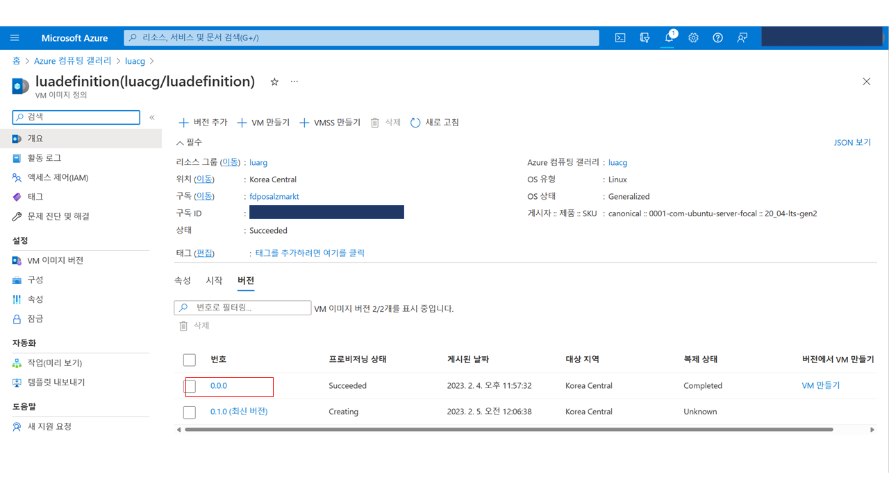

# 애저 VMSS와 스케일링 시나리오 확인하기
이번 핸즈온랩 세션을 통해 VMSS용 이미지 생성, Compute Gallery 활용, 스케일링 규칙 설정 및 알림 설정에 관해 알아봅니다. 핸즈온랩 데모 시나리오는 아래와 같습니다.
  
---
## 데모 시나리오

#### 실습 주제
   -  VMSS에서 제공하는 스케일링 조건을 직접 활용해서 VM 이미지를 업데이트 합니다.  
  
#### 실습 목표  #
  -   VMSS에서 제공하는 스케일링 기능을 확인하고 컴퓨팅 갤러리 및 애저 모니터 알림 기능을 실제로 구현해 봅니다.

#### VMSS 데모 시나리오  #

  -   커스텀 이미지 제작용 VM을 한 대 배포합니다(luavm).
  -   배포한 VM에 stress툴을 설치합니다.
  -   VM을 기반으로 이미지를 두 장 만들고(0.0.0, 0.1.0), Compute Gallery에 저장합니다.
  -   0.0.0 이미지를 기반으로 VMSS를 생성합니다(luavmss).
  -   비용 절감을 위해 기존 luavm은 삭제합니다.
  -   luavmss에 CPU percentage를 기반으로 한 오토스케일링 규칙을 설정합니다.
  -   Scale-In시 OldestVM부터 삭제되도록 규칙을 설정합니다.
  -   luavmss\_0 인스턴스가 어떤 이미지를 참조하고 있는지 확인합니다(0.0.0).
  -   CLI 명령어를 통해 0.1.0 이미지를 참조하도록 설정값을 변경합니다.
      -   az vmss update --resource-group luarg --name luavmss --set virtualMachineProfile.storageProfile.imageReference.id=/subscriptions/{subscriptionID}/resourceGroups/luarg/providers/Microsoft.Compute/galleries/luacg/images/luadefinition/versions/0.1.0
  -   CLI 명령어를 통해 이미지를 0.1.0을 참조하도록 설정하였더라도 개별 인스턴스는 여전히 0.0.0이미지 기반임을 확인합니다.
      -   az vmss show --name luavmss --resource-group luarg --instance-id 0
  -   0번 인스턴스의 직렬 콘솔로 접속해서 로그인 후 stress --cpu 4 커맨드를 입력합니다.
  -   인스턴스가 스케일아웃 된 것과 또한 최신 이미지(0.1.0)를 기반으로 생성됐음을  확인합니다.
  -   stress를 멈추고 스케일인 되는 것을 확인합니다. 이 때 OldestVM인 인스턴스 숫자가 작은 VM부터 삭제되는 것을 확인합니다.
  -   Activity log에서 Autoscale scale up completed 와 Autoscale scale down completed 에 대해 알림을 설정합니다.
  -   마지막으로 실습에서 사용했던 리소스 그룹을 삭제합니다.


---

## 이미지 제작용 VM 생성
커스텀 이미지 제작용 VM을 생성합니다.  
포털 메인 화면 상단에 위치한 검색창에 '가상 머신'을 입력합니다.  
포털 설정이 영어로 되어있는 경우 Virtual Machines를 입력합니다.


리소스 생성에 알맞은 구독을 선택하고 리소스 그룹을 새로 생성합니다. 
stress 툴 사용을 위해 Ubuntu 이미지를 선택합니다.


새로운 탭을 연 후 shell.azure.com에 접속하여 방금 생성한 VM의 public IP로 ssh연결합니다.  
```
ssh yourID@123.234.345.456
```


id와 password를 입력한 후 stress툴을 설치합니다.
```
sudo apt-get update
sudo apt install stress
```
툴 설치가 끝났으면 포털 VM 창으로 돌아와서 캡쳐 버튼을 눌러 이미지를 만듭니다.


이 때 이미지를 저장할 Compute Gallery도 함께 생성합니다.


버전은 0.0.0으로 명시합니다.


리소스 배포가 완료됐을 경우 definition리소스를 클릭하여 0.1.0 버전의 이미지를 하나 더 생성합니다.


이미지의 버전 변경(0.0.0 -> 0.1.0)만 확인할 것이기 때문에 기존 luavm의 disk를 기반으로 0.1.0 버전의 이미지를 만듭니다.


0.1.0 버전까지 제작 후 비용 절감을 위해 luavm은 삭제합니다.


  
  

---

## 이미지 기반으로 VMSS 생성하기

컴퓨팅 갤러리에서 0.0.0 이미지를 기반으로 VMSS를 생성합니다.





신규 워크로드에 대해서는 Flexible VMSS를 권장하고 있으나, 실습을 위해 'Uniform 모드(균일성 모드)'를 선택합니다.


이미지 버전이 0.0.0이 맞는지 확인합니다. 또한 실습의 편의성을 위해 인증 형식은 암호를 선택합니다. 필요한 값을 모두 입력하였으면 '검토+만들기' 버튼을 눌러 리소스를 배포합니다.


리소스가 배포되었으면 생성된 luavmss의 '확장 중 - 구성'탭에 들어가서 오토스케일링을 설정합니다. '규칙 추가'버튼을 눌러 오토스케일링 조건을 입력합니다. 


CPU Percentage가 30% 초과일 경우 스케일아웃, 미만일 경우 스케일인 조건을 설정합니다. 조금 더 빠른 스케일 아웃을 위해 기간은 5분으로 설정합니다.


스케일인 규칙도 추가합니다.


마지막으로 최소값, 최대값, 기본값에 각각 1, 10, 2를 입력한 후 저장 버튼을 누릅니다.  
기본값은 메트릭 수집이 안되는 상황에서 인스턴스 개수를 의미합니다.


저장 후 규모 감축 정책 탭에서 OldestVM 옵션을 선택한 후 저장 버튼을 누릅니다.


인스턴스 탭에서 현재 배포된 VM들이 최신 모델인지 확인합니다. 


그리고 0번 인스턴스를 클릭해서 어떤 이미지를 기반으로 생성되었는지 확인할 수 있습니다.


혹은 shell.azure.com에서 CLI를 통해 아래 명령어를 통해 현재 참조중인 이미지를 확인할 수 있습니다.
```
az vmss show –resource-group luarg –name luavmss

```


이제 VMSS가 참조중인 이미지 버전을 0.1.0으로 바꿔봅니다. 아래 명령어를 통해 바꿀 수 있습니다. 
```
az vmss update --resource-group luarg --name luavmss --set virtualMachineProfile.storageProfile.imageReference.id=/subscriptions/{yourAzureSubscriptionID}/luarg/providers/Microsoft.Compute/galleries/luacg/images/luadefinition/versions/0.1.0

```

여기서 imageReference.id는 아래 화면에서 확인하실 수 있습니다.


VMSS에서 참조하는 이미지 버전은 바꾸었으나 기존 인스턴스는 여전히 0.0.0버전입니다. 아래 명령어를 통해서 확인합니다.
```
az vmss show --name luavmss --resource-group luarg --instance-id 0

```


VMSS의 인스턴스 탭에서 확인해 보니 참조 이미지를 변경했기 때문에 최신 모델이 아니라고 표시된 것을 확인할 수 있습니다. 0번 인스턴스에 stress를 주기 위해 0번 인스턴스를 클릭한 후 직렬 콘솔을 클릭합니다.


직렬 콘솔의 경우 id와 password를 통한 VM 접속만 허용합니다.  
id와 password를 입력해서 접속한 후 아래 명령어를 통해 stress를 줍니다.
```
stress --cpu 4
```


잠시 후 기존에 없던 2번과 3번 인스턴스가 생성된 것을 확인할 수 있습니다. 또한 0번, 1번 인스턴스와 달리 최신 모델임을 역시 확인할 수 있습니다.

 

CLI를 통해서도 확인할 수 있습니다.
```
az vmss show --name luavmss --resource-group luarg --instance-id 2
```


다시 직렬 콘솔 화면으로 돌아와 Ctrl + C 를 눌러 스트레스 툴을 중지시킵니다.


CPU Percentage가 낮아짐에 따라 Oldest VM인 0번 및 1번 인스턴스가 삭제되는 것을 확인할 수 있습니다. 이로써 0.0.0버전을 참조하는 VM은 모두 삭제되었고, 0.1.0버전을 참조하는 VM만 남게 되었습니다.


여기까지 스케일링을 통해 수동으로 이미지 버전을 업데이트 하는 과정을 학습하셨습니다. 실습 환경에서는 CPU Percentage 메트릭을 기반으로 스케일링 하였으나, 실제 운영 환경에서는 매뉴얼 스케일링(수동 크기 조정)으로 조작하실 수 있습니다.
  
  
  ---

## 스케일링 알림 설정

VMSS에서 스케일링 활동이 일어날 때 담당자에게 문자나 메일로 알람이 가도록 설정할 수 있습니다. VMSS 화면에서 활동 로그 탭을 클릭합니다.


Autoscale scale down completed를 선택 후 '새로운 경고 규칙' 버튼을 클릭합니다.


범위를 확인합니다. 현재 실습에서는 luavmss에 대한 알림만 설정하도록 하겠습니다.


'조건'탭에서 실패와 성공시 알림을 받을 수 있도록 선택합니다.


알림을 받을 그룹을 생성해야 합니다. 작업 그룹 만들기 버튼을 선택합니다. 


알림 이름을 설정하고 검토+만들기 버튼을 클릭합니다.


작업 그룹 이름에 방금 만든 그룹이 추가된 것을 확인합니다.


세부 정보에서 경고 규칙 이름을 입력한 후 검토+만들기 버튼을 클릭합니다. 그리고 스케일아웃에 대해서도 같은 방법으로 알림을 설정합니다.


작업 그룹에 포함되면 아래와 같은 이메일을 받게 됩니다.


스케일링 액션이 발생하면 아래와 같이 이메일로 알림을 받게 됩니다.

  
  ---
## 마무리
마지막으로 실습에 사용했던 리소스를 모두 삭제합니다.

---
## 추가 링크
추가적인 학습을 원하시는 분은 아래 링크를 참고하실 수 있습니다.
  -   https://youtu.be/2BrckSF7ICI
  -   https://youtu.be/BlSVX1WqTXk
  -   https://learn.microsoft.com/en-us/azure/virtual-machine-scale-sets/tutorial-create-and-manage-cli

