# 애저 기반 서버리스 웹 애플리케이션 개발 실습

- [애저 기반 서버리스 웹 애플리케이션 개발 실습](#애저-기반-서버리스-웹-애플리케이션-개발-실습)
  - [실습 주제](#실습-주제)
    - [실습 내용](#실습-내용)
  - [애저 스토리지 계정 생성하기](#애저-스토리지-계정-생성하기)
  - [애저 펑션 만들기](#애저-펑션-만들기)
  - [HTML 파일 만들기](#html-파일-만들기)
  - [스토리지 계정에 HTML 파일 넣기](#스토리지-계정에-html-파일-넣기)
  - [구성 테스트](#구성-테스트)
  - [관련 실습](#관련-실습)


## 실습 주제

본 실습에서는 애저 펑션을 활용하여 서버리스 환경에서 웹 애플리케이션을 만드는 것으로, 별도의 서버 개설 없이 웹 애플리케이션을 개발 및 실행하는 것을 목표로 합니다. 서버리스 앱을 만들기 위해서는 애플리케이션의 프론트앤드에서부터 백앤드까지 지원해주는 애저 스토리지 설정이 필요합니다. 실습에 사용될 HTML파일은 새롭게 만들어진 애저 스토리지 계정에 호스팅 됩니다. 애저 스토리지 계정, 애저 펑션을 새로 설정하고, 테스트를 위한 HTML 페이지를 만들 것입니다.

### 실습 내용

- 애저 스토리지 계정 생성하기
- 애저 펑션 만들기
- HTML 파일 만들기
- 스토리지 계정에 HTML 파일 넣기
- 구성 테스트


## 애저 스토리지 계정 생성하기


애저 스토리지 계정은 마이크로소프트 애저 스토리지 솔루션 중 하나로, Blob 스토리지에서의 파일 공유, 큐, 테이블, 디스크 등 모든 애저 스토리지 데이터 개체를 포함한 데이터 저장소를 관리합니다. 애저 스토리지 계정은 유니크한 네임스페이스를 제공하여 HTTP나 HTTPS를 통해 어디에서나 데이터를 접근할 수 있게 도와줍니다. 본 실습을 하기 위해서는 애저 스토리지 계정을 구축해야 하며, 크게 두 가지의 방법이 존재합니다. 애저 클라우드 셸 접속을 하거나 VS Code를 통해 실행이 가능하며, 본 실습에서는 사용자의 편의를 위해 애저 클라우드 셸에 접속하여 웹 브라우저에서 CLI(Command-Line Interface)를 사용합니다.

1. 애저 포털([https://portal.azure.com/](https://portal.azure.com/))에 접속하여, 사용 가능한 계정으로 로그인합니다.

    

2. 애저 클라우드 셸([https://shell.azure.com](https://shell.azure.com))에 접속합니다.

    

3. 접속한 애저 환경에 탑재된 스토리지가 없을 경우 아래와 같은 화면이 나타납니다. 희망하는 구독명을 입력한 뒤 [스토리지 만들기]를 클릭해줍니다.
    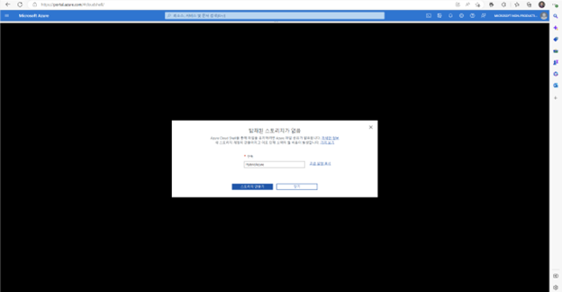

4. Bash와 PowerShell 중 [PowerShell]을 선택하면, 로딩 후 커맨드를 입력할 수 있는 환경이 나타납니다.

    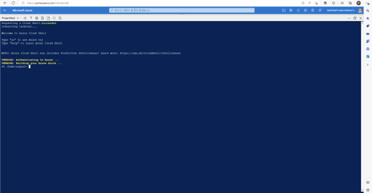

5. 현재 접속되어 있는 계정에 포함된 구독 정보를 확인하기 위해 아래의 커맨드를 입력한 뒤 엔터키를 입력합니다.
    
    ```powershell
    az account list --query [].[name,id]
    ```

    

6. 리소스 그룹을 생성하기 위하여 아래의 커맨드를 입력한 뒤 엔터키를 입력합니다.
    
    ```powershell
    az group create `
        --location southeastasia `
        --name RG_Serverless
    ```

    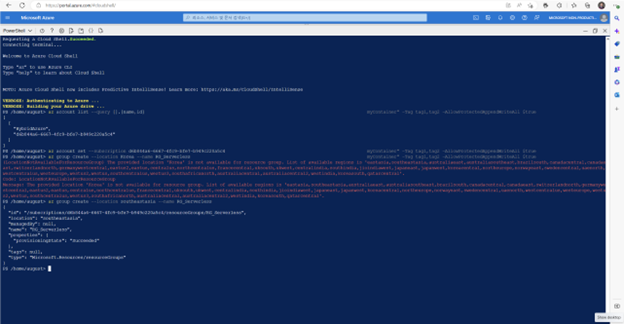

7. 애저 스토리지 계정를 생성하기 위하여 아래의 커맨드를 입력한 뒤 엔터키를 입력합니다.
   단, 스토리지 계정의 이름을 정할 때는 소문자와 숫자 조합만 입력이 가능함을 유의하기 바랍니다.

    ```powershell
    az storage account create `
        --location southeastasia `
        --name saserverless0 `
        --resource-group RG_Serverless `
        --sku Standard_LRS `
        --kind StorageV2
    ```

    

8. 웹사이트 호스팅을 위해 필요한 자료들이 저장될 애저 스토리지 Blob에 권한 설정을 하기 위해 다음의 커맨드를 입력한 뒤 엔터키를 입력합니다.

    ```powershell
    az storage blob service-properties update `
    --account-name saserverless0 `
    --static-website `
    --index-document index.html
    ```

    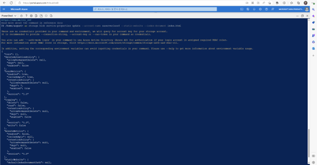

9. 애저 포탈에서 '스토리지 계정'에 접속하여 좌측 메뉴 '데이터 관리' 내 '정적 웹 사이트'를 클릭합니다.

    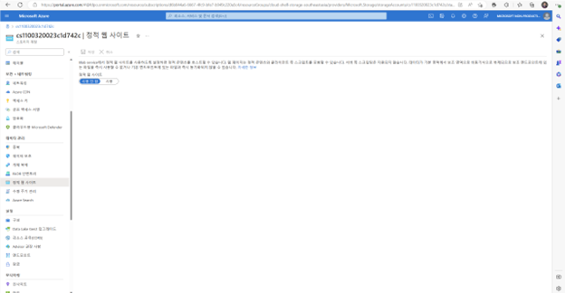

10. '정적 웹 사이트'의 설정으로 '사용'으로 변경한 뒤, 다음과 같이 정보를 변경합니다.
    웹 애플리케이션의 랜딩 페이지가 될 index.html 파일은 현재 존재하지 않지만, 추후에 생성하게 됩니다.

    - 인덱스 문서 이름 : index.html

    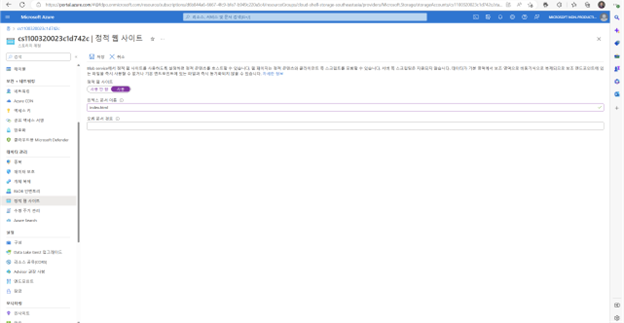

11. 저장 후 나타나게 되는 '기본 엔드포인트' 주소는 별도로 저장해두기 바랍니다.

    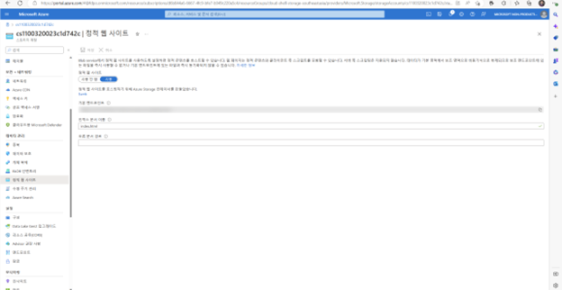


## 애저 펑션 만들기


애저 펑션은 이벤트 기반의 서버리스 컴퓨팅 플랫폼을 사용하여 서버리스 애플리케이션 개발을 가속화 및 간소화해줍니다. 엔드 투 엔드 개발 환경에서 이미 익숙한 프로그래밍 언어를 지원하며, 추가 설정 없이 로컬에서 빌드 및 디버그하고 클라우드에서 대규모로 배포 및 운영하며 트리거와 바인딩을 사용하여 서비스를 통합합니다.

서버리스 웹 애플리케이션의 프론트엔드를 담당하는 HTML 웹페이지는 애저 스토리지 계정에 저장되어 있으며, 실제 웹페이지에서의 기능 작동과 실행을 담당하는 앤드포인트는 JavaScript에 저장되어 있습니다. 

1. 애플리케이션 내에서 사용될 애저 함수를 구성하기 위해 환경을 준비합니다. 다음의 커맨드를 입력한 뒤 엔터키를 입력합니다.

    ```powershell
    az functionapp create `
        --resource-group RG_Serverless `
        --consumption-plan-location southeastasia `
        --name functionserverless0 `
        --storage-account saserverless0 `
        --runtime node `
        --functions-version 3
    ```

    

2. 구성이 완료된 후 애저 클라우드 셸에서 자세한 정보를 확인할 수 있는 링크를 발견할 수 있습니다. 예를 들어 `https://portal.azure.com/#resource/subscriptions/{{구독_ID}}/resourceGroups/RG_Serverless/providers/microsoft.insights/components/functionserverless0/overview`와 같은 형태의 링크로 존재합니다.

3. 실제 리소스 그룹과 애플리케이션 내 기능들이 실행되기 위해서는 CORS의 설정을 변경해야 합니다. 이때 마지막 항목에는 이전에 복사해 두었던 정적 웹 페이지의 URL을 입력합니다. 다음의 커맨드를 입력한 뒤 엔터키를 입력합니다.

    ```powershell
    az functionapp cors add `
        --resource-group RG_Serverless `
        --name functionserverless0 `
        --allowed-origins https://cs1100320023c1d742c.z23.web.core.windows.net/
    ```

    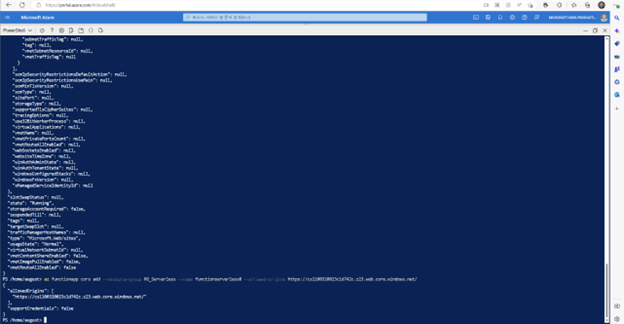

4. 애저 포탈에서 '함수 앱'에 접속하여 좌측 메뉴 'API' 내 'CORS'를 클릭합니다.

    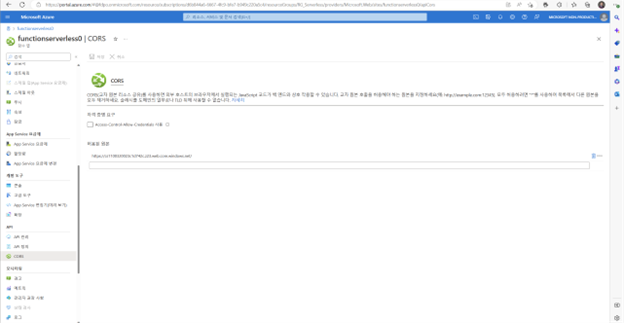

5. '허용된 원본'에 새롭게 추가한 사용자의 정적 웹사이트 URL이 포함되어 있는지 확인합니다.

6. 함수 앱 내에서 실제 애플리케이션에 사용할 함수 앱을 추가합니다. 좌측 메뉴 '함수' 내 '함수'를 선택한 뒤, [만들기] 버튼을 클릭합니다. [만들기]의 경우 활성화가 되기 까지 몇 초간의 로딩이 필요할 수 있습니다.

    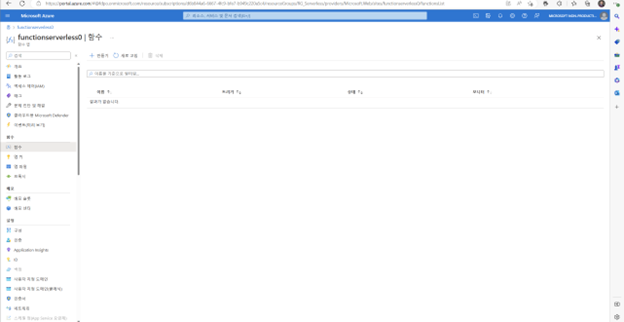

7. 다음과 같이 설정 후 '템플릿 선택' 내에서 'HTTP trigger'를 선택합니다.

    - 개발 환경 : 포털에서 개발

    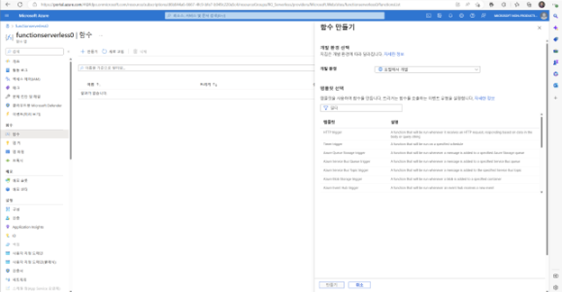

8. 다음과 같이 설정 후 하단의 [만들기] 버튼을 클릭합니다.

    - 새 함수 : FnToDoList
    - Authorization level : Anonymous

    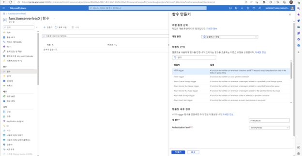

9. 좌측 메뉴 '개발자' 내 '코드 + 테스트'를 선택합니다. HTTP로 트리거링이 되었을 때 index.html 파일에 함께 실행되는 실제 JavaScript 파일을 확인합니다.

    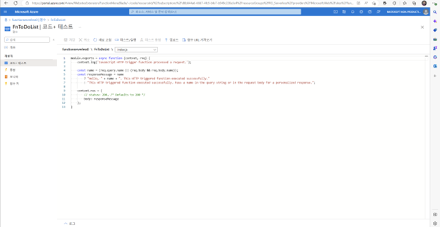

10. 다음과 같이 설정 후 'URL' 값을 복사합니다.

    - 키 : default(Function Key)
 
    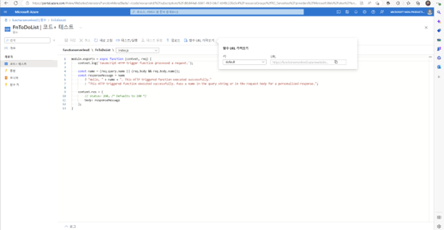

## HTML 파일 만들기

웹 애플리케이션의 랜딩 페이지인 index.html 파일을 사용자가 원하는대로 만들어줍니다.


## 스토리지 계정에 HTML 파일 넣기

본 단계에서는 모든 설정을 마친 뒤 실제 웹 애플리케이션이 구동될 수 있는 index.html 파일을 애저 환경에 복사해봅니다.

1. 애저 포탈에서 '스토리지 계정'에 접속하여 좌측 메뉴 '데이터 관리' 내 '정적 웹 사이트'를 클릭합니다.

2. 정적 웹 사이트를 호스팅하기 위해 애저 스토리지 컨테이너를 만들었습니다.’ 아래의  '$web' 를 선택합니다. 
    
    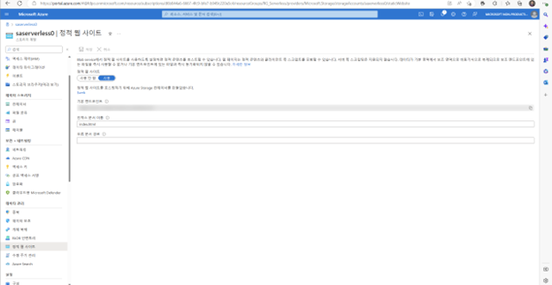

3. 상단의 [업로드] 버튼을 클릭합니다.

    

4. 우측 다이얼로그에 작성한 HTML 파일을 업로드한 뒤 [업로드] 버튼을 클릭합니다.

    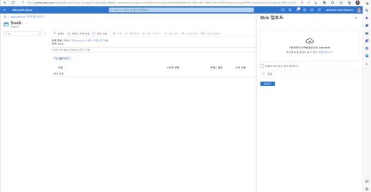

5. 정상적으로 HTML 파일이 업로드 되었는지 확인합니다.

    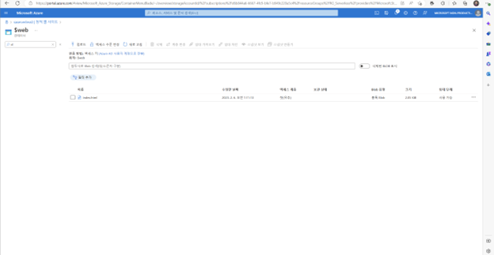


## 구성 테스트

본 단계에서는 서버리스로 구성한 웹 애플리케이션이 정상적으로 작동하는지 확인합니다.

1. 애저 스토리지 계정 생성하기 단계의 11번째에서 저장한 '엔드 포인트' 주소를 웹 브라우저를 통해 접근합니다.

2. 정상적으로 홈페이지가 작동하는지 확인합니다.

3. 여기까지 애저 서버리스를 활용해 간단한 웹 애플리케이션을 직접 구성해보았습니다.


## 관련 실습

아래 URL을 통해 다른 네트워크 실습들도 진행해 보실 수 있습니다.

- [서버리스 애플리케이션 만들기](https://learn.microsoft.com/ko-kr/training/paths/create-serverless-applications/?WT.mc_id=dotnet-87053-juyoo)
- [서버리스 웹 애플리케이션 아키텍처](https://learn.microsoft.com/ko-kr/azure/architecture/reference-architectures/serverless/web-app?WT.mc_id=dotnet-87053-juyoo)
- [서버리스 웹 애플리케이션 만들기 실습](https://learn.microsoft.com/ko-kr/labs/build2018/serverlesswebapp/?WT.mc_id=dotnet-87053-juyoo)


**긴 시간 동안 수고 많으셨습니다 🙂**
