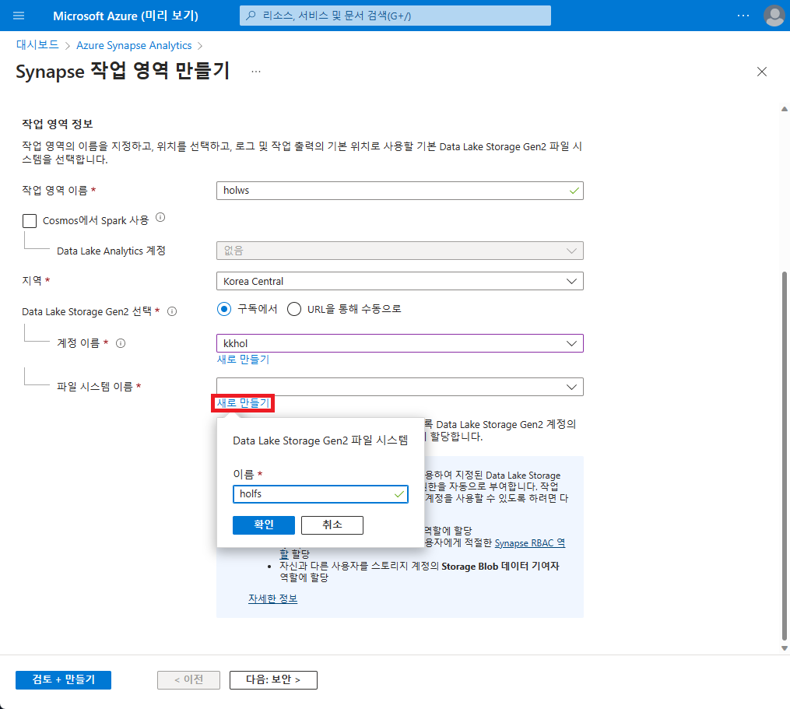
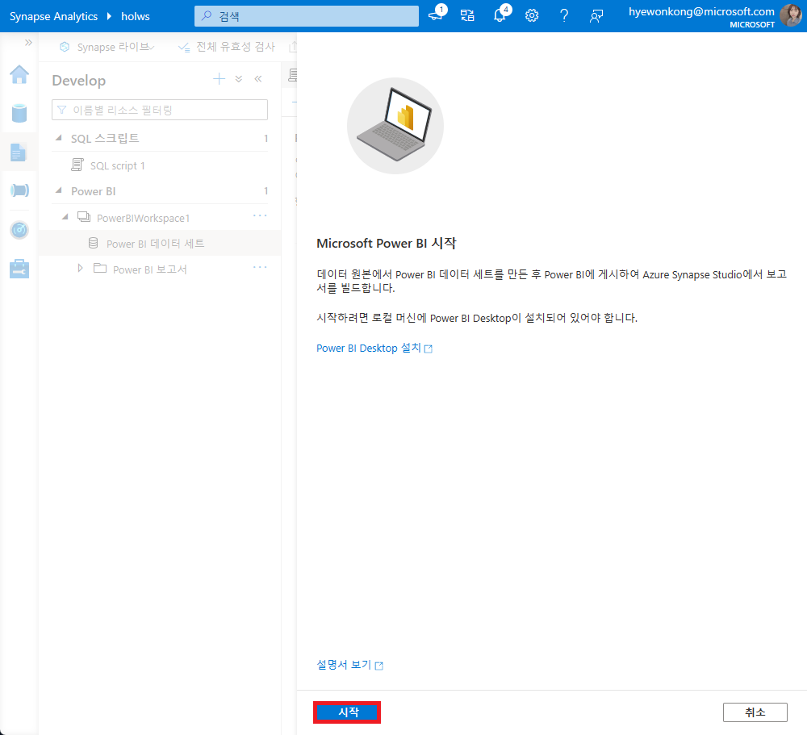

# 애저 스트림 애널리틱스 기반 실시간 스트리밍 데이터 분석하기

[TOC]


## 실습 주제

애저 스트림 애널리틱스 서비스를 이용하여 실시간으로 발생하는 데이터 에서 원하는 데이터만 추출하여 애저 시냅스 애널리틱스에 적재하고, 추가로 Power BI 를 이용하여 데이터를 시각화 하는 것을 목표로 합니다. 


## 리소스 그룹 생성

애저 리소스 그룹은 애저 리소스를 보유하는 단위로, 생성한 리소스에 대한 메타데이터를 저장합니다. 하나의 리소스 그룹의 범위는 쉽게 배포, 업데이트, 삭제 할 수 있도록 동일한 수명 주기를 공유하는 서비스(혹은 프로젝트) 단위로 하는 것을 권장합니다.

1. 애저 포털 상단의 검색 바에서 '리소스 그룹'을 검색하여 서비스 메뉴로 이동합니다.


2. 만들기 버튼을 선택합니다.


3. 리소스 그룹에 이름을 입력합니다. (예:hol-rg) 영역은 (Asia Pacific) Korea Central로 선택합니다.


## 템플릿 다운로드

스트리밍 데이터를 생성하는 어플리케이션을 배포하기 위하여 [TollApp Azure Template 배포](https://portal.azure.com/#create/Microsoft.Template/uri/https%3A%2F%2Fraw.githubusercontent.com%2FAzure%2Fazure-stream-analytics%2Fmaster%2FSamples%2FTollApp%2FVSProjects%2FTollAppDeployment%2Fazuredeploy.json) 링크를 클릭하여 템플릿을 애저 포털로 불러옵니다.

1. 리소스 그룹에서 전 단계에서 생성한 리소스 그룹을 선택합니다.


## 스토리지 계정 생성

1. 전 단계의 템플릿 배포가 진행되는 동안 애저 포탈 상단 검색 바에서 '스토리지 계정'을 검색하여 서비스 메뉴로 이동합니다.


2. 만들기 버튼을 선택합니다.


3. 리소스 그룹에서 생성한 리소스 그룹을 선택하고, 스토리지 계정 이름을 고유한 이름으로 작성합니다. 아래 설정에 맞게 선택한 뒤, 다음을 눌러 '데이터 보호' 단계로 이동합니다.

   지역 : (Asia Pacific) Korea Central

   프리미엄 계정 유형 : 블록 Blob

   중복 : LRS


4. 아래 두 정책의 체크 박스를 해제한 뒤 [Review] 버튼을 눌러 설정을 최종 점검한 다음 생성을 시작합니다.


5. 스토리지 계정 생성이 완료되면 리소스 페이지의 왼쪽 중간에 위치한 '설정' - 'Data Lake Gen2 업그레이드'를 선택합니다.


6. 단계 별 진행을 완료하여 업그레이드를 진행 합니다.


## Azure Synapse Analytics생성

1. 애저 포탈 상단 검색 바에서 Azure synapse analytics를 검색하여 서비스 페이지로 이동합니다.


2. 만들기 버튼을 선택합니다.


3. 리소스 그룹에서 생성한 리소스 그룹을 선택하고 작업 영역 이름을 적절하게 작성합니다. (예:holws) 아래 설정에 맞게 선택한 뒤 파일 시스템 이름에서 새로 만들기를 선택합니다.

   지역 : Korea Central

   Data Lake Storage Gen2 선택 : 구독에서

   계정이름 : {생성한 스토리지 계정 명}

   파일 시스템 이름 : [새로 만들기]




4. 다음 단계인 '보안'에서 'SQL Server 관리자 로그인' 계정의 암호를 작성하고 검토 후 생성을 시작합니다.


5. 생성이 완료되면 Synapse 작업영역 개요 화면에서 '새 전용 SQL풀'을 선택합니다.


6. 전용 SQL 풀 이름을 적절히 작성한 뒤 성능 수준은 DW100c로 설정하고 검토 후 생성을 시작합니다.


7. 새 전용 SQL풀 생성이 완료되면 작업 영역 웹 URL을 확인할 수 있습니다.


8. Synapse 작업 영역 웹 페이지에서 '새로만들기'-'SQL스크립트'를 선택합니다.


9. 쿼리 입력창 중간에 '...'을 선택하여 연결 대상을 생성한 전용 SQL풀로 변경합니다. 그 다음 아래 쿼리를 쿼리창에 입력한 뒤 실행합니다. 쿼리가 정상적으로 실행되면 '모두 게시' 버튼을 선택합니다.

```sql
CREATE TABLE carsummary   
(  
Make nvarchar(20),  
CarCount int,
  times datetime
  )
WITH ( CLUSTERED COLUMNSTORE INDEX ) ;
```


10. 작성한 SQL 스크립트가 변경될 내용에 포함된 것을 확인하고 '게시'를 선택합니다.


## 생성한 리소스 점검

실행에 필요한 애저 리소스들은 모두 생성이 완료 되었습니다. 템플릿을 이용하여 배포한 서비스들 각각의 역할에 대하여 검토를 합니다. 본 실습에 사용되는 애저 서비스들은 아래와 같습니다.

- Synapse Analytics : Stream Analytics의 Output 역할로 정재된 데이터들을 저장.
- Stream Analytics : Event Hub로 들어온 스트리밍 데이터들을 필요한 정보만 추출하여 Synapse Analytics로 전달.
- App Service : Toll App역할. Toll gate로 들어오는 나가는 차량 정보를 생성하여 Event Hub로 전달.
- Event Hub : App Service에서 발생한 데이터를 라이브 스트리밍 하여 Stream Analytics로 전달.


## EventHub  설정

1. 리소스 그룹의 리소스 목록에서 생성된 Event Hubs 네임스페이스를 선택합니다.


2. 리소스 페이지 왼쪽 메뉴바 중간에 'Event Hubs'를 선택합니다.


3. 이벤트 허브 목록 중에 'entrystream'을 선택합니다.


4. 왼쪽 메뉴 바 중간에 '기능'-'데이터 처리'를 선택합니다.


5. 화면을 스크롤 하여 하단에 '빈 캔버스로 시작'을 선택합니다.


6. 새 Stream Analytics 작업 명을 적절하게 입력합니다.(예:hol-asa-job)


7. 이벤트 허브에 연결하기 위한 정보가 적절한지 확인 하고 '연결' 버튼을 선택합니다.

   Serialization : Json

   인증 모드 : 연결 문자열

   이벤트 허브 공유 액세스 키 이름 : RootManageSharedAccessKey


8. 연결이 완료 되면 미리 보기 창에서 데이터가 정상적으로 불러오는지 확인합니다.


9. '운영'-'그룹화 방법'을 선택합니다.


10. 그룹화 방법 박스와 이벤트 허브 박스를 연결선을 드래그하여 연결합니다. 오른쪽 그룹화 방법 설정 화면에서 아래 설정에 맞게 선택 후 저장합니다.

    집계 유형 : 개수

    필드 : Make

    집계 그룹화 기준 : Make

    지속 시간 : 3분


11. '운영'-'필드 관리'를 선택합니다.


12. 필드 관리 박스와 그룹화 방법 박스를 연결선을 드래그하여 연결합니다. 오른쪽 필드 추가 버튼을 눌러 Make를 선택합니다.

    다시 필드 추가 버튼을 눌러 COUNT_Make를 선택한 뒤, 이름을 CarCount로 변경합니다. Window_End_Time 필드를 추가하여 이름을 times로 변경한 뒤 저장합니다.


13. '출력'-'Synapse'를 선택합니다.


14. Synapse 박스와 필드 관리 박스를 연결선을 드래그 하여 연결합니다. 오른쪽 Synapse 설정에서 '선택'을 선택합니다.


15. '스토리지 계정 추가' 버튼을 선택합니다.


16. 생성한 Blob 스토리지 계정명이 선택되었는지 확인하고 저장 버튼을 선택합니다.


17. 생성한 전용SQL풀과 SQL사용자 계정 정보를 입력하고 테이블 명을 carsummary로 입력한 다음 '연결'을 선택합니다.


18. 미리 보기 창에서 데이터를 확인한 다음 '저장'버튼을 선택합니다.


19. '시작' 버튼을 누른 다음 '지금' 출력, 스트리밍 단위 '3'으로 설정하여 '시작'버튼을 선택합니다.


20. Stream Analytics 작업 창을 닫은 후, 상태 창에서 Running중인 것을 확인 합니다.


21. Synapse Analytics 웹 페이지 왼쪽 메뉴에서 'Data' 탭을 선택한 뒤, 'SQL데이터베이스'-'{생성한 전용 SQL풀}'-'carsummary'-'...' 버튼을 선택 한뒤 [새 SQL스크립트]-[상위 100개 행 선택]을 선택하여 데이터가 정상적으로 추출되는 것을 확인 합니다.


## (Optional)Power BI로 시각화 하기

사전에 Power BI Desktop이 설치 되어 있어야 하며, 작업 영역이 생성 되어 있어야 합니다.

1. Synapse 작업 영역 페이지 왼쪽 바에서 'Manage'를 선택한 뒤, 'Linked services' 새로 만들기를 선택 합니다.


2. 'Power BI에 연결'을 선택 합니다.


3. '이름'에 적절한 네이밍을 입력한 후 '만들기'버튼을 선택 합니다.


4. '모두 게시' 버튼을 선택 합니다. 


5. 변경 될 서비스 내용을 확인한 후 '게시' 버튼을 선택 합니다.


6. 왼쪽 바에서 'Develop'을 선택한 다음 'Power BI 데이터 세트'를 선택하여 새 Power BI 데이터 세트를 생성합니다.


7. '시작' 버튼을 선택 합니다.



8. 생성한 전용 SQL풀을 데이터 원본으로 선택 합니다.


9. .pbids파일을 다운로드 받습니다.


10. 다운로드 받은 .pbids 파일을 실행하면 carsummary 테이블을 로드 합니다.


11. 연결 설정은 'Direct Query'로 선택 합니다.


12. 맨 오른쪽 데이터에서 CarCount, Make, times 를 체크하고 시각화에서 '꺾은 선 형 그래프'를 선택합니다.

    x축 : times

    y축 : CarCount

    범례 : Make


