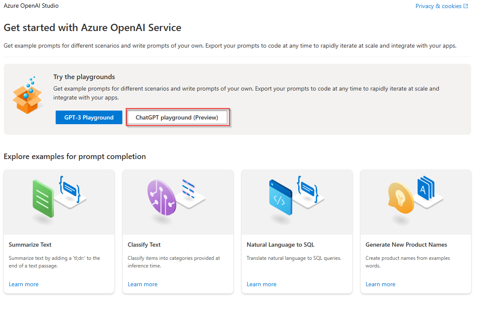
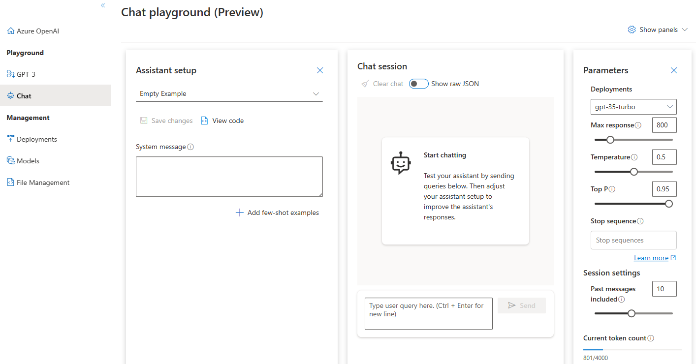
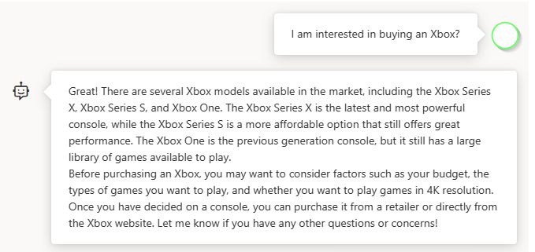
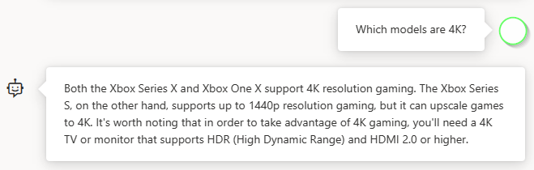

# Azure OpenAI 활용하기

## 실습 주제

[Azure OpenAI](https://learn.microsoft.com/ko-kr/azure/cognitive-services/openai/overview)에서 OpenAI에서 제공한는 다양한 LLM(Large Language Model) 를 활용하여 서비스를 구성해볼 수 있습니다. 

- [Azure OpenAI 모델](https://learn.microsoft.com/ko-kr/azure/cognitive-services/openai/concepts/models)


## 사전 준비 

### 액세스 신청

현재 이 서비스에 대한 액세스 권한은 애플리케이션에서만 부여됩니다. [신청 사이트](https://aka.ms/oai/access)에서 양식을 작성하여 Azure OpenAI에 대한 액세스를 신청할 수 있습니다. 

### 리소스 만들기
- Azure에서 [OpenAI 리소스 만들기](https://learn.microsoft.com/ko-kr/azure/cognitive-services/openai/how-to/create-resource?pivots=web-portal)


## 실습 내용

### Azure AI Studio - Chat
1. Azure AI Studio 방문 페이지에서 채팅 플레이그라운드를 선택합니다.

    

2. 채팅 플레이그라운드에서 ChatGPT 서비스를 활용하기 위해 도우미 설정을 합니다. 
    - 도우미 설정 드롭다운을 사용하여 미리 로드된 몇 가지 시스템 메시지 예제를 선택하여 시작할 수 있습니다.

    - 시스템 메시지는 동작하는 방법과 응답을 생성할 때 참조해야 하는 컨텍스트에 대한 지침을 모델에 제공합니다. 도우미의 성격을 설명하고, 대답해야 하는 것과 대답해서는 안 되는 것을 말하고, 응답의 형식을 지정하는 방법을 말할 수 있습니다.

    - 몇 가지 샷 예제를 추가하면 모델이 컨텍스트 내 학습에 사용하는 대화형 예제를 제공할 수 있습니다.

    - 채팅 플레이그라운드를 사용하는 동안 언제든지 코드 보기를 선택하여 현재 채팅 세션 및 설정 선택에 따라 미리 채워진 Python, curl 및 json 코드 샘플을 볼 수 있습니다. 그런 다음, 이 코드를 사용하고 애플리케이션을 작성하여 현재 플레이그라운드에서 수행하고 있는 것과 동일한 작업을 완료할 수 있습니다.

    

3. 채팅 세션
    - 보내기 단추를 선택하면 입력한 텍스트가 완료 API로 전송되고 결과가 다시 텍스트 상자로 반환됩니다.

    - 채팅 지우기 단추를 선택하여 현재 대화 기록을 삭제합니다.

4. 파라미터 설정

    | 이름 | 설명 |
    |---|---|
    | 배포 | 특정 모델과 연결된 배포 이름입니다. ChatGPT의 경우 gpt-35-turbo 모델을 사용해야 합니다. |
    | 온도 | 임의성을 제어합니다. 온도를 낮추면 모델이 더 반복적이고 결정적인 응답을 생성합니다. 온도를 높이면 예기치 않거나 창의적인 응답이 발생합니다. 온도 또는 상위 P 중 하나만 조정해 보세요. |
    | 최대 길이(토큰) | 모델 응답당 토큰 수 한도를 설정합니다. API는 프롬프트(시스템 메시지, 예제, 메시지 기록 및 사용자 쿼리 포함)와 모델의 응답 간에 공유되는 최대 4,096개의 토큰을 지원합니다. 하나의 토큰은 일반적인 영어 텍스트의 경우 대략 4자입니다. |
    | 상위 확률 | 온도와 마찬가지로 임의성을 제어하지만 다른 방법을 사용합니다. 상위 P를 낮추면 모델의 토큰 선택 대상이 유사 토큰으로 좁혀지게 됩니다. 상위 P를 늘리면 모델이 가능성이 높고 낮은 토큰 중에서 선택할 수 있습니다. 온도 또는 상위 P 중 하나만 조정해 보세요. |
    | 멀티 턴 대화 | 각 새 API 요청에 포함할 과거 메시지 수를 선택합니다. 이렇게 하면 새 사용자 쿼리에 대한 모델 컨텍스트를 제공할 수 있습니다. 이 숫자를 10으로 설정하면 5개의 사용자 쿼리와 5개의 시스템 응답이 생성됩니다. |
    | 중지 시퀀스 | 중지 시퀀스는 모델이 원하는 지점에서 응답을 종료하도록 합니다. 모델 응답은 지정된 시퀀스 이전에 종료되므로 중지 시퀀스 텍스트가 포함되지 않습니다. ChatGPT의 경우 를 사용하면 모델 응답이 후속 사용자 쿼리를 생성하지 않습니다. 최대 4개의 중지 시퀀스를 포함할 수 있습니다. |

5. 채팅 세션 시작
    1. 도우미 설정 드롭다운에서 Xbox 고객 지원 에이전트를 선택합니다.

    2. 시스템 메시지를 업데이트할지 묻는 메시지가 표시되면 계속을 선택합니다.

    3. 채팅 세션 창에서 "새 Xbox를 구입하는 데 관심이 있습니다"라는 질문을 입력하고 보내기를 선택합니다.

    4. 다음과 유사한 응답이 수신됩니다.
        

    5. "4K를 지원하는 모델은 무엇입니까?"와 같은 후속 질문을 입력합니다.
    
        

    6. 이제 기본 대화가 있으므로 도우미 설정에서 코드 보기를 선택하면 지금까지 진행된 전체 대화 뒤에 코드가 재생됩니다.

        ```python
        #Note: The openai-python library support for Azure OpenAI is in preview.
        import os
        import openai
        openai.api_type = "azure"
        openai.api_base = "https://docs-test-001.openai.azure.com/"
        openai.api_version = "2023-05-15"
        openai.api_key = os.getenv("OPENAI_API_KEY")

        response = openai.ChatCompletion.create(
        engine="gpt-35-turbo", # replace this value with the deployment name you chose when you deployed the associated model.
        messages = [{"role":"system","content":"You are an Xbox customer support agent whose primary goal is to help users with issues they are experiencing with their Xbox devices. You are friendly and concise. You only provide factual answers to queries, and do not provide answers that are not related to Xbox."},{"role":"user","content":"How much is a PS5?"},{"role":"assistant","content":"I apologize, but I do not have information about the prices of other gaming devices such as the PS5. My primary focus is to assist with issues regarding Xbox devices. Is there a specific issue you are having with your Xbox device that I may be able to help with?"},{"role":"user","content":"I am interested in buying an Xbox?"},{"role":"assistant","content":"Great! There are several Xbox models available in the market, including the Xbox Series X, Xbox Series S, and Xbox One. The Xbox Series X is the latest and most powerful console, while the Xbox Series S is a more affordable option that still offers great performance. The Xbox One is the previous generation console, but it still has a large library of games available to play.\n\nBefore purchasing an Xbox, you may want to consider factors such as your budget, the types of games you want to play, and whether you want to play games in 4K resolution. Once you have decided on a console, you can purchase it from a retailer or directly from the Xbox website. Let me know if you have any other questions or concerns!"},{"role":"user","content":"Which models are 4K?"},{"role":"assistant","content":"Both the Xbox Series X and Xbox One X support 4K resolution gaming. The Xbox Series S, on the other hand, supports up to 1440p resolution gaming, but it can upscale games to 4K. It's worth noting that in order to take advantage of 4K gaming, you'll need a 4K TV or monitor that supports HDR (High Dynamic Range) and HDMI 2.0 or higher."}],
        temperature=0,
        max_tokens=350,
        top_p=0.95,
        frequency_penalty=0,
        presence_penalty=0,
        stop=None)
        ```


### 더 알아보기

- [Azure OpenAI 활용 | Microsoft Learn](https://learn.microsoft.com/ko-kr/azure/cognitive-services/openai/quickstart?tabs=command-line&pivots=programming-language-studio)
- [프롬프트 엔지니어링](https://github.com/daeungo1/azure-openai-samples/blob/main/quick_start/07_best_practice.ipynb)


