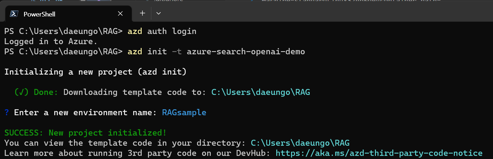
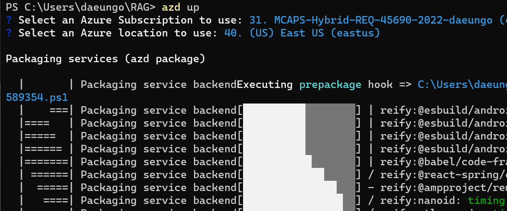
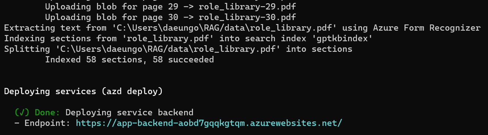

# 챗GPT + 기업 데이터 with Azure OpenAI & Cognitive Search

 
이 샘플은 RAG(Retrieval Augmented Generation) 패턴을 사용하여 자신의 데이터에 대해 ChatGPT와 같은 경험을 생성하기 위한 몇 가지 접근 방식을 보여줍니다. Azure OpenAI Service를 사용하여 ChatGPT 모델(gpt-35-turbo)에 액세스하고 Azure Cognitive Search를 사용하여 데이터 인덱싱 및 검색을 수행합니다.

리포지토리에는 샘플 데이터가 포함되어 있으므로 처음부터 끝까지 시도할 준비가 되었습니다. 이 샘플 응용 프로그램에서는 Contoso Electronics라는 가상의 회사를 사용하며 경험을 통해 직원은 혜택, 내부 정책, 직무 설명 및 역할에 대해 질문할 수 있습니다.

## 특징 

* 채팅 및 Q&A 인터페이스
* 사용자가 인용, 소스 콘텐츠 추적 등으로 응답의 신뢰성을 평가하는 데 도움이 되는 다양한 옵션을 탐색합니다.
* 데이터 준비, 신속한 구성, 모델(ChatGPT)과 인지 검색(Cognitive Search) 간의 상호 작용 오케스트레이션에 대한 가능한 접근 방식을 보여줍니다.
* 행동을 조정하고 옵션을 실험하기 위해 UX에서 직접 설정

## 시작하기

> **중요:** 이 예제를 배포하고 실행하려면 **Azure OpenAI 서비스에 대해 액세스가 활성화된 Azure 구독**이 필요합니다. [여기](https://aka.ms/oaiapply)에서 액세스를 요청할 수 있습니다. [여기](https://azure.microsoft.com/free/cognitive-search/)를 방문하여 무료 Azure 크레딧을 받아 시작할 수도 있습니다.

> **AZURE 리소스 비용** 기본적으로 이 샘플은 월별 비용이 있는 Azure App Service 및 Azure Cognitive Search 리소스와 문서 페이지당 비용이 있는 Form Recognizer 리소스를 만듭니다. infra 폴더 아래의 매개 변수 파일을 변경하여 이 비용을 피하려면 각각의 무료 버전으로 전환할 수 있습니다(고려해야 할 몇 가지 제한이 있지만, 예를 들어 당 최대 1개의 무료 Cognitive Search 리소스를 보유할 수 있음). 무료 Form Recognizer 리소스는 각 문서의 처음 2페이지만 분석합니다.)

### 사전 준비 

#### 로컬 환경 준비 작업
- [Azure 개발자 CLI](https://learn.microsoft.com/ko-kr/azure/developer/azure-developer-cli/install-azd?tabs=winget-windows%2Cbrew-mac%2Cscript-linux&pivots=os-windows) 
- [파이썬 3+](https://www.python.org/downloads/)
     - **중요**: 설치 스크립트가 작동하려면 Python 및 pip 패키지 관리자가 Windows의 경로에 있어야 합니다.
     - **중요**: 콘솔에서 `python --version`을 실행할 수 있는지 확인하세요. Ubuntu에서 `python`을 `python3`에 연결하려면 `sudo apt install python-is-python3`을 실행해야 할 수 있습니다.
- [Node.js](https://nodejs.org/en/download/)
- [Git](https://git-scm.com/downloads)
- [Powershell 7+ (pwsh)](https://github.com/powershell/powershell) - Windows 사용자 전용.
    - **중요**: PowerShell 명령에서 `pwsh.exe`를 실행할 수 있는지 확인하세요. 이것이 실패하면 PowerShell을 업그레이드해야 할 수 있습니다.

>참고: Azure 계정에는 [사용자 액세스 관리자](https://learn.microsoft.com/azure/role-based-access-control/built-in)와 같은 `Microsoft.Authorization/roleAssignments/write` 권한이 있어야 합니다. -roles#user-access-administrator) 또는 [소유자](https://learn.microsoft.com/azure/role-based-access-control/built-in-roles#owner).

#### GitHub Codespaces 또는 VS Code 원격 컨테이너에서 실행하려면

GitHub Codespaces 또는 VS Code 원격 컨테이너를 사용하여 이 리포지토리를 가상으로 실행할 수 있습니다. 아래 버튼 중 하나를 클릭하여 해당 옵션 중 하나에서 이 저장소를 엽니다.

### 실습 진행 

#### 프로젝트 시작하기 

1. 새 폴더를 만들고 터미널에서 해당 폴더로 전환합니다.
2. `azd auth login` 실행
3. `azd init -t azure-search-openai-demo` 실행
     * 대상 위치의 경우 이 샘플에 사용된 모델을 현재 지원하는 지역은 **미국 동부** 또는 **미국 중남부**입니다. 최신 지역 및 모델 목록은 [여기](https://learn.microsoft.com/en-us/azure/cognitive-services/openai/concepts/models)를 확인하세요.
     * 이 명령은 git 저장소를 초기화하므로 이 저장소를 복제할 필요가 없습니다.

#### 처음 단계 진행:

기존 Azure 서비스가 없고 새 배포에서 시작하려는 경우 다음 명령을 실행합니다.

1. `azd up` 실행 - Azure 리소스를 프로비저닝하고 `./data` 폴더에 있는 파일을 기반으로 검색 인덱스를 빌드하는 것을 포함하여 이 샘플을 해당 리소스에 배포합니다.

    

2. 응용 프로그램이 성공적으로 배포되면 URL이 콘솔에 인쇄된 것을 볼 수 있습니다. 해당 URL을 클릭하면 브라우저에서 애플리케이션과 상호 작용할 수 있습니다.

    다음과 같이 표시됩니다.

    

    
> 참고: 애플리케이션이 완전히 배포되는 데 몇분 정도 걸릴 수 있습니다. "Python 개발자" 시작 화면이 표시되면 잠시 기다렸다가 페이지를 새로 고칩니다.

#### 기존 리소스 사용:

1. `azd env set AZURE_OPENAI_SERVICE {기존 OpenAI 서비스 이름}` 실행
1. `azd env set AZURE_OPENAI_RESOURCE_GROUP {OpenAI 서비스가 프로비저닝되는 기존 리소스 그룹의 이름}`을 실행합니다.
1. `azd env set AZURE_OPENAI_CHATGPT_DEPLOYMENT {기존 ChatGPT 배포 이름}`을 실행합니다. ChatGPT 배포가 기본 '채팅'이 아닌 경우에만 필요합니다.
1. `azd env set AZURE_OPENAI_GPT_DEPLOYMENT {기존 GPT 배포 이름}`을 실행합니다. ChatGPT 배포가 기본 'davinci'가 아닌 경우에만 필요합니다.
1. `azd up` 실행

> 참고: 기존 검색 및 저장소 계정을 사용할 수도 있습니다. 기존 리소스를 구성하기 위해 `azd env set`에 전달할 환경 변수 목록은 `./infra/main.parameters.json`을 참조하세요.

#### 리포지토리의 로컬 복제 배포 또는 재배포:
* 간단히 `azd up`을 실행하십시오.

#### 로컬에서 실행:
1. `azd auth login` 실행
2. dir을 `app`으로 변경
3. `./start.ps1` 또는 `./start.sh`를 실행하거나 "VS Code 작업: 앱 시작"을 실행하여 로컬에서 프로젝트를 시작합니다.

#### 환경 공유하기

다른 사람에게 완전히 배포된 기존 환경에 대한 액세스 권한을 부여하려면 다음을 실행하십시오.

1. [Azure CLI](https://learn.microsoft.com/ko-kr/cli/azure/install-azure-cli) 설치
1. `azd init -t azure-search-openai-demo` 실행
1. `azd env refresh -e {environment name}` 실행 - 이 명령을 실행하려면 azd 환경 이름, 구독 ID 및 위치가 필요합니다. 해당 값은 `./azure/{env name에서 찾을 수 있습니다. }/.env` 파일. 이렇게 하면 앱을 로컬에서 실행하는 데 필요한 모든 설정으로 azd 환경의 .env 파일이 채워집니다.
1. `pwsh ./scripts/roles.ps1` 실행 - 사용자가 로컬에서 앱을 실행할 수 있도록 필요한 모든 역할을 사용자에게 할당합니다. 구독에서 역할을 만드는 데 필요한 권한이 없는 경우 이 스크립트를 실행해야 할 수 있습니다. azd .env 파일 또는 활성 셸에서 `AZURE_PRINCIPAL_ID` 환경 변수를 Azure Id로 설정해야 합니다. 이 ID는 `az account show`로 가져올 수 있습니다.

### 빠른 시작

* Azure에서: azd에서 배포한 Azure WebApp으로 이동합니다. URL은 azd가 완료되면("Endpoint"으로) 출력되거나 Azure Portal에서 찾을 수 있습니다.
* 로컬에서 실행: 127.0.0.1:5000으로 이동

#### 웹 앱에서 확인:
* 채팅 또는 Q&A 컨텍스트에서 다른 주제를 시도해 보십시오. 채팅의 경우 후속 질문, 설명을 시도하고 답변을 단순화하거나 정교하게 요청하는 등의 작업을 수행합니다.
* 인용 및 출처 탐색
* "설정"을 클릭하여 다른 옵션, 조정 프롬프트 등을 시도하십시오.

## 자원

* [ChatGPT로 엔터프라이즈 데이터 혁신: Azure OpenAI 및 Cognitive Search를 통한 차세대 앱](https://learn.microsoft.com/ko-kr/azure/search/search-what-is-azure-search)
* [Azure OpenAI 서비스](https://learn.microsoft.com/ko-kr/azure/cognitive-services/openai/overview)

### 메모
>참고: 이 데모에 사용된 PDF 문서에는 언어 모델(Azure OpenAI Service)을 사용하여 생성된 정보가 포함되어 있습니다. 이 문서에 포함된 정보는 데모용으로만 제공되며 Microsoft의 의견이나 신념을 반영하지 않습니다. Microsoft는 이 문서에 포함된 정보와 관련하여 완전성, 정확성, 신뢰성, 적합성 또는 가용성에 대해 명시적이든 묵시적이든 어떠한 종류의 진술이나 보증도 하지 않습니다. 모든 권리는 Microsoft에 있습니다.

### 자주하는 질문

***질문***: Azure Cognitive Search가 대용량 문서 검색을 지원하는 경우 PDF를 청크로 분할해야 하는 이유는 무엇입니까?

***답변***: 청킹을 사용하면 토큰 제한으로 인해 OpenAI에 보내는 정보의 양을 제한할 수 있습니다. 콘텐츠를 분해하면 OpenAI에 주입할 수 있는 잠재적인 텍스트 덩어리를 쉽게 찾을 수 있습니다. 우리가 사용하는 청크 방법은 한 청크를 끝내는 문장이 다음 청크를 시작하도록 텍스트의 슬라이딩 윈도우를 활용합니다. 이를 통해 텍스트의 맥락을 잃을 가능성을 줄일 수 있습니다.

### 문제 해결

`azd deploy`를 실행하는 동안 `read /tmp/azd1992237260/backend_env/lib64: is a directory` 오류가 표시되면 `./app/backend/backend_env 폴더`를 삭제하고 `azd deploy`를 다시 실행합니다. 명령. 이 문제는 https://github.com/Azure/azure-dev/issues/1237 에서 추적되고 있습니다.

웹앱 배포에 실패하고 브라우저에 '404 찾을 수 없음' 메시지가 표시되면 'azd deploy'를 실행합니다.
