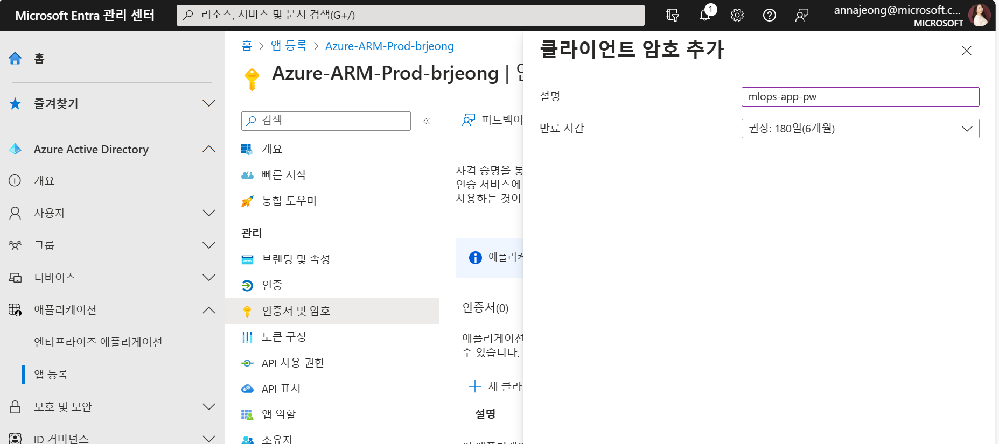
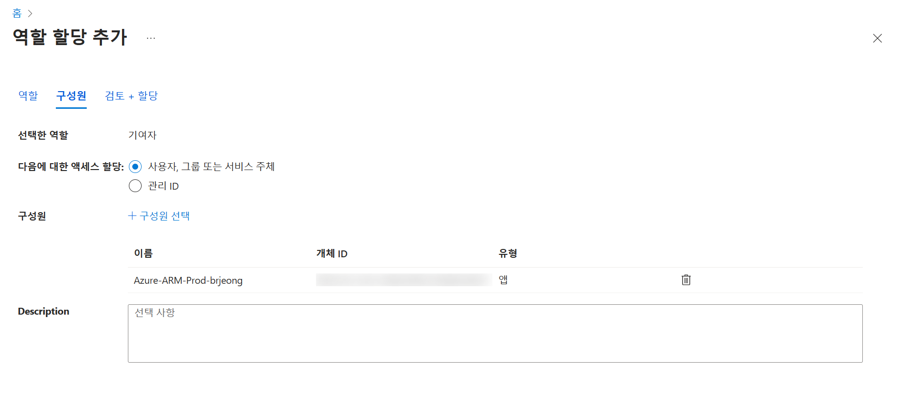
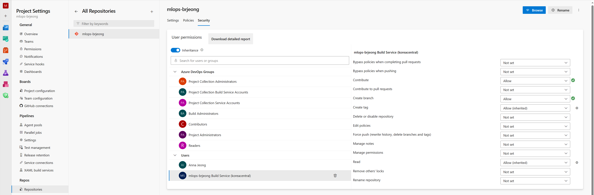
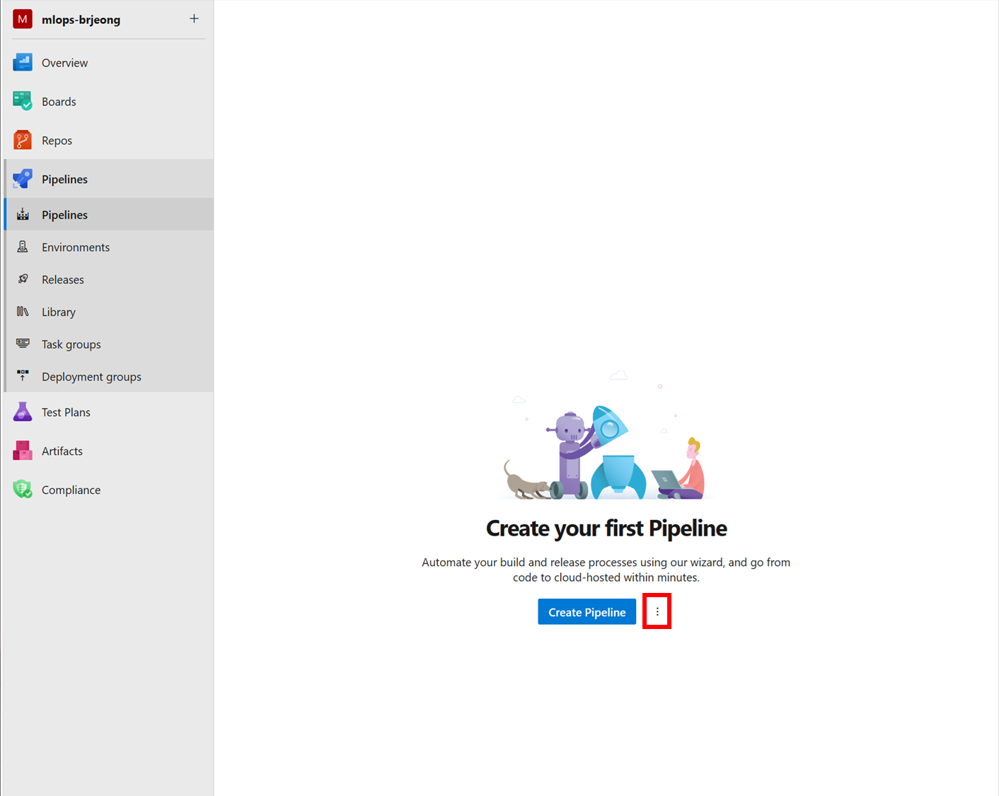
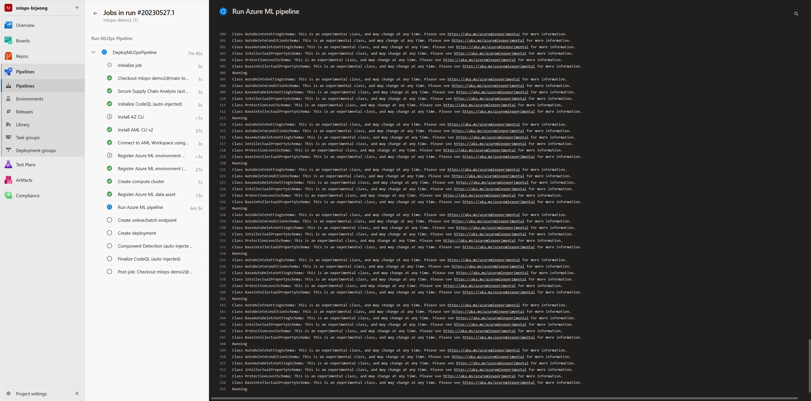
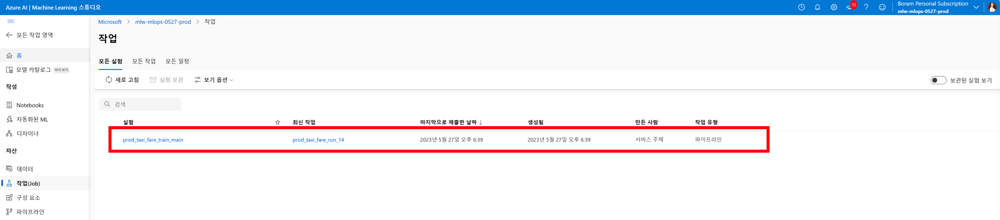
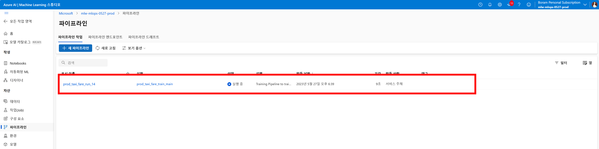
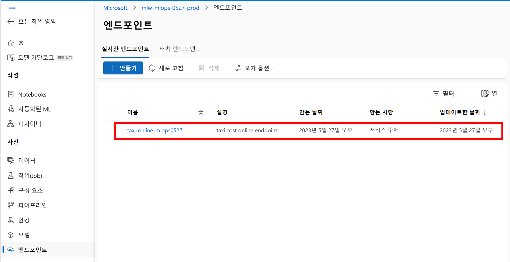
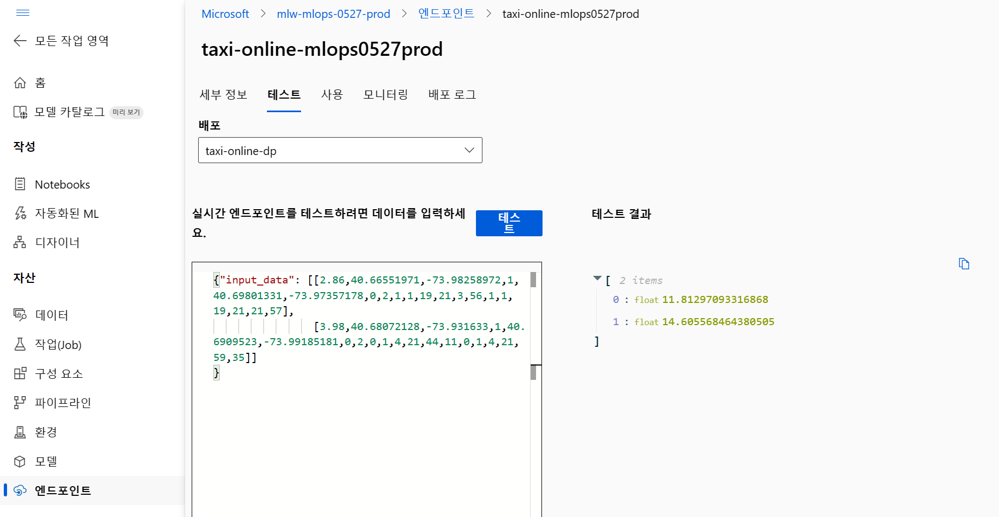

# Azure DevOps를 활용한 MLOps 파이프라인 구성

## 실습 주제

Azure Machine Learning을 사용하면 [Azure DevOps 파이프라인](https://learn.microsoft.com/ko-kr/azure/devops/pipelines/)과 통합하여 기계 학습 수명 주기를 자동화할 수 있습니다. 자동화할 수 있는 일부 작업은 다음과 같습니다.

- Azure Machine Learning 인프라 배포
- 데이터 준비(추출, 변환, 로드 작업)
- 주문형 스케일 아웃 및 스케일 업으로 기계 학습 모델 학습
- 공용 또는 프라이빗 웹 서비스로 기계 학습 모델 배포
- 배포된 기계 학습 모델 모니터링(예: 성능 분석용)

### 사전 준비

- [서비스 주체 만들기](#서비스-주체-만들기)
- Azure DevOps [조직](https://learn.microsoft.com/ko-kr/azure/devops/organizations/accounts/create-organization)

### 실습 내용

- [Azure DevOps 설정](#azure-devops-설정)
- [원본 리포지토리 설정](#원본-리포지토리-설정)
- [Azure DevOps를 통해 인프라 배포](#azure-devops를-통해-인프라-배포)
- [MLOps 파이프라인 배포](#mlops-파이프라인-배포)
- [엔드포인트 테스트](#엔드포인트-테스트)

## 사전 준비

### 서비스 주체 만들기

실습을 진행하려면 작업하려는 환경 수에 따라 서비스 주체를 만들어야 합니다.

1. [Azure 앱 등록](https://entra.microsoft.com/#view/Microsoft_AAD_RegisteredApps/ApplicationsListBlade/quickStartType%7E/null/sourceTypeMicrosoft_AAD_IAM)으로 이동합니다.
2. `새 등록` 버튼을 클릭합니다.
3. 아래와 같이 구성 후 `등록` 버튼을 클릭합니다.
    - 이름 : Azure-ARM-Prod-<alias>
    - 지원되는 계정 유형 : 모든 조직 디렉터리의 계정(모든 Azure AD 디렉터리 - 다중 테넌트)
4. 애플리케이션이 생성되면 `인증서 및 암호 메뉴`를 클릭합니다.
5. `클라이언트 비밀` 탭에서 `새 클라이언트 암호`를 클릭 후 클라이언트 암호를 추가하고, `값`과 `비밀 ID`를 따로 저장해 둡니다.
    
    
    
6. [애저 포털](https://portal.azure.com/)을 열고 구독 페이지로 이동합니다.
7. 액세스 제어(IAM) 메뉴를 선택하고 `추가` 버튼을 클릭하고 `역할 할당 추가`를 클릭합니다.
8. `역할`에서 `권한 있는 관리자 역할` 탭을 클릭하고 `기여자`를 선택한 뒤, `다음` 버튼을 클릭합니다.
9. `구성원` 탭에서 `다음에 대한 액세스 할당`에서 `사용자, 그룹 또는 서비스 주체`를 선택하고 `구성원 선택` 클릭 후 생성한 서비스 주체를 선택하고 `검토 + 할당` 버튼을 클릭합니다.
    
    
    

## 실습 내용

### Azure DevOps 설정

1. [Azure DevOps](https://go.microsoft.com/fwlink/?LinkId=2014676&githubsi=true&clcid=0x409&WebUserId=2ecdcbf9a1ae497d934540f4edce2b7d)로 이동합니다.
2. 왼쪽 메뉴에서 자신이 선택한 조직을 선택합니다.
3. `New project` 버튼을 클릭합니다.
4. 아래와 같이 설정 후, `Create` 버튼을 클릭합니다.
    - Project name : mlops-<alias>
    - Visibility : Private
5. 왼쪽 하단의 `Project Settings`을 클릭 후, `Service connections`를 클릭합니다.
6. `Create service connection` 버튼을 클릭 후, `Connection type`에서 `Azure Resource Manager`를 선택하고 `Next` 버튼을 클릭합니다.
7. `Authentication method`에서 `Service Principal (manual)`을 선택하고 `Next` 버튼을 클릭합니다.
8. 아래와 같이 구성한 뒤, `Verify and Save` 버튼을 클릭합니다.
    - Environment : Azure Cloud
    - Scope Level : Subscription
    - Subscription Id : 생성한 구독의 ID
    - Subscription Name : 생성한 구독의 이름
    - Service Principal Id : 사전 준비에서 생성한 애플리케이션의 ID
    - Service Principal key : 사전 준비에서 생성한 애플리케이션의 `클라이언트 암호`의 `값`
    - Tenant ID : 생성한 구독이 속해있는 테넌트의 ID
    - Service connection name : Azure-ARM-Prod
    - Security : Grant access permission to all pipelines
    
    
    

### 원본 리포지토리 설정

1. [Azure DevOps](https://dev.azure.com/)에서 만든 프로젝트를 엽니다.
2. 왼쪽 메뉴에서 `Repos` 메뉴를 선택하고 Import a repository에서 `Import` 버튼을 클릭합니다.
3. Clone URL에 [https://github.com/brjeong-private/mlops-demo.git](https://github.com/brjeong-private/mlops-demo.git) 을 입력하고 `Import` 버튼을 클릭합니다.
4. 왼쪽 탐색 창 아래쪽에서 `프로젝트 설정`을 엽니다.
5. Repos에서 `Repositories` 메뉴를 선택하고 이전 단계에서 만든 리포지토리를 선택하고 `Security` 탭을 선택합니다.
6. User permissions 섹션에서 `mlops-<alias>Build Service (koreacentral)` 사용자를 선택합니다. `Contribute / Create branch` 권한을 `Allow`로 변경합니다.
    
    
    
7. 왼쪽 메뉴에서 `Pipelines` 메뉴를 선택합니다. Create Pipeline 버튼 옆에 `점 세개가 있는` 버튼을 클릭하고 `Manage security` 를 선택합니다.
    
    
    
8. `Build Service 계정`을 선택 후, `Edit build pipeline` 권한을 `Allow`로 변경합니다.

### Azure DevOps를 통해 인프라 배포

1. `mlops-demo` 리포지토리로 이동하여 `config-infra-prod.yml` 파일을 선택합니다.
2. 이 구성 파일은 고유성을 보장하기 위해 아티팩트 이름의 네임스페이스 및 접미사 값을 사용합니다. 구성에서 다음 섹션을 원하는 대로 업데이트합니다.
    
    ```yaml
     namespace: [5 max random new letters]
     postfix: [4 max random new digits]
     location: koreacentral
    ```
    
3. 커밋 후 푸시 코드를 선택하여 이러한 값을 파이프라인으로 가져옵니다
4. `Pipelines` 페이지로 이동합니다.
5. `Create Pipeline` 버튼을 클릭합니다.
6. `Azure Repos Git`를 선택하고 생성한 리포지토리를 클릭합니다.
7. `Existing Azure Pipelines YAML` 파일을 선택합니다.
8. `Path`에서 `mlops/devops-pipelines/deploy-infra.yml`를 선택하고 `Continue` 버튼을 클릭합니다.
9. 파이프라인을 실행합니다. 완료될 때까지 몇 분 정도 걸립니다. 파이프라인은 다음 아티팩트를 만들어야 합니다.
  - 스토리지 계정, Container Registry, Application Insights, Keyvault 및 Azure Machine Learning 작업 영역 자체를 포함한 작업 영역의 리소스 그룹
  - 작업 영역에는 컴퓨팅 클러스터도 만들어집니다.
10. 이제 MLOps 프로젝트의 인프라가 배포되었습니다.

### MLOps 파이프라인 배포

1. `Pipelines` 페이지로 이동합니다.
2. `Create Pipeline` 버튼을 클릭합니다.
3. `Azure Repos Git`를 선택하고 생성한 리포지토리를 클릭합니다.
4. `Existing Azure Pipelines YAML` 파일을 선택합니다.
5. `Path`에서 `mlops/devops-pipelines/deploy-mlops-pipeline.yml`를 선택하고 `Continue` 버튼을 클릭합니다.
6. 파이프라인을 실행합니다. 완료될 때까지 몇 분 정도 걸립니다. 

```yaml
stages:
- stage: RunMLOpsPipeline
  displayName: Run MLOps Pipeline

  jobs:
    - job: DeployMLOpsPipeline
      timeoutInMinutes: 120
      steps:
      - checkout: self
        path: s/

        # 모든 파이프라인에는 Azure CLI에 대한 ML 확장이 필요합니다. AZ CLI 설치부터 시작합니다.
      - template: /aml-cli-v2/install-az-cli.yml

        # 이 단계에서는 Azure CLI를 사용하여 Azure ML CLI를 설치합니다.
      - template: /aml-cli-v2/install-aml-cli.yml

        # 이 단계는 Azure ML CLI에 대한 기본 작업 영역 및 리소스 그룹을 구성합니다.
        # 각 명령에 작업 공간 이름과 리소스 그룹 이름을 전달하는 대신
        # 작업 공간은 기본 작업 공간으로 설정됩니다.
        # 이 단계는 Azure ML CLI를 사용하여 작업 영역에 연결합니다.
      - template: /mlops/azureml/connect/connect-to-workspace.yml

        # 환경 등록 단계는 환경이 존재하는지 여부를 확인합니다.
        # 존재하지 않으면 등록합니다. 존재하는 경우 등록을 건너뜁니다.
        # 환경이 이미 존재할 때 오류를 피하기 위함입니다.
        # 이 단계는 Azure ML CLI를 사용하여 환경을 등록합니다.
      - template: /aml-cli-v2/register-environment.yml
        parameters:
          build_type: conda
          environment_name: taxi-train-env
          environment_file: mlops/azureml/train/train-env.yml

        # 참고: 이것은 모델 학습을 위한 컴퓨팅 리소스입니다.
        # 컴퓨팅 생성 단계는 컴퓨팅이 존재하는지 여부를 확인합니다.
        # 이는 컴퓨팅이 아직 존재하지 않을 때 오류를 방지하기 위한 것입니다.
        # 존재하지 않으면 생성합니다. 존재하는 경우 생성을 건너뜁니다.
        # 이 단계는 Azure ML CLI를 사용하여 컴퓨팅 대상을 만듭니다.
      - template: /aml-cli-v2/create-compute.yml
        parameters:
          cluster_name: $(training_target)
          size: $(training_target_sku)
          min_instances: ${{ variables.training_target_min_nodes }}
          max_instances: ${{ variables.training_target_max_nodes }}
          cluster_tier: $(training_target_tier)

        # 이 단계에서는 Azure ML CLI를 사용하여 AML에 데이터를 등록합니다.
      - template: /aml-cli-v2/register-data.yml
        parameters:
          data_type: uri_file
          data_name: taxi-data
          data_file: mlops/azureml/train/data.yml

          
        # 이 단계에서는 Azure ML CLI를 사용하여 파이프라인을 실행합니다.
        # 이 단계는 또한 파이프라인을 제출한 후 파이프라인이 완료될 때까지 기다립니다.
        # 이것은 프로덕션 파이프라인에 대한 모범 사례가 아닐 수 있습니다.
        # 프로덕션에서는 파이프라인을 실행한 다음 다른 단계를 계속할 수 있습니다.
        # 파이프라인을 모니터링할 수 있으며 필요한 경우 ML Workspace에서 파이프라인을 중지할 수 있습니다.
      - template: /aml-cli-v2/run-pipeline.yml
        parameters:
          pipeline_file: mlops/azureml/train/pipeline.yml
          experiment_name: $(environment)_taxi_fare_train_$(Build.SourceBranchName)
          display_name: $(environment)_taxi_fare_run_$(Build.BuildID)
        
        # 이 단계에서는 Azure ML CLI를 사용하여 온라인 배포를 테스트합니다.
      - template: /aml-cli-v2/create-endpoint.yml
        parameters:
          endpoint_file: mlops/azureml/deploy/online/online-endpoint.yml

        # 이 단계는 Azure ML CLI를 사용하여 온라인 배포를 생성합니다.
      - template: /aml-cli-v2/create-deployment.yml
        parameters:
          deployment_name: taxi-online-dp
          deployment_file: mlops/azureml/deploy/online/online-deployment.yml
```

**파이프라인 실행 확인**



**작업 / 파이프라인 / 엔드포인트 생성 확인**





### 엔드포인트 테스트

1. 애저 포털에 접속하여 왼쪽 상단 검색 메뉴에서 Machine Learning Studio를 입력하여 페이지로 이동합니다.
2. 리스트에서 `mlw-<namespace>-<postfix>-prod` 를 선택하고 `Studio 시작하기` 버튼을 클릭합니다.
3. 왼쪽 메뉴에서 `엔드포인트`를 클릭하고 생성된 `온라인 엔드포인트`를 선택합니다.
    
    
    
4. 정상적으로 엔드포인트가 생성됐는지 확인합니다. 엔드포인트 이름 밑의 탭에서 `테스트` 탭을 선택합니다.
5. 리포지토리의 `/data/taxi-request.json` 파일의 내용을 입력하고 `테스트` 버튼을 클릭합니다.
    
    
    

### 더 알아보기

- [MLflow 및 Azure Machine Learning - Azure Machine Learning | Microsoft Learn](https://learn.microsoft.com/ko-kr/azure/machine-learning/concept-mlflow?view=azureml-api-2)
- [GitHub로 MLOps 설정 - Azure Machine Learning | Microsoft Learn](https://learn.microsoft.com/ko-kr/azure/machine-learning/how-to-setup-mlops-github-azure-ml?view=azureml-api-2&tabs=azure-shell)