# Power Platform에서 OpenAI 사용하기

본 Light Up Azure 세션에서는 Azure API Management와 대표적인 로우코드 솔루션인 Power Platform를 활용하여, OpenAI 및 Azure OpenAI를 사용하고 다양한 애플리케이션을 개발하는 방법에 대하여 알아봅니다.

Power Platform의 사용자 친화적인 개발 환경에서 Azure API Management 서비스의 강력한 API 관리 기능을 활용하여, 효율적으로 애플리케이션 및 인터페이스를 구축할 수 있습니다. 

## 사전 준비물

- [Power Apps Developer 구독](https://powerapps.microsoft.com/developerplan/)
- [OpenAI 계정](https://openai.com/)
- [OpenAI API키](https://platform.openai.com/account/api-keys)
- [Azure OpenAI 서비스](https://oai.azure.com/)
- [Azure 구독](https://azure.microsoft.com/ko-kr/free/)


## 한눈에 보기
- [실습 주제](#실습-주제)
- [Azure API Management 서비스 만들기](#azure-api-management-서비스-만들기)
- [OpenAI API를 HTTP API로 만들기](#openai-api를-http-api로-만들기)
- [Azure API Management 서비스로 Power Apps 이미지 생성 애플리케이션 만들기](#azure-api-management-서비스로-power-apps-이미지-생성-애플리케이션-만들기)
- [Azure OpenAI API를 OpenAPI로 만들기](#azure-openai-api를-openapi로-만들기)
- [Azure API Management 서비스로 Power Apps 텍스트 생성 애플리케이션 만들기](#azure-api-management-서비스로-power-apps-텍스트-생성-애플리케이션-만들기)
- [AI Builder로 Power Apps 이미지 해석 애플리케이션 만들기](#ai-builder로-power-apps-이미지-해석-애플리케이션-만들기)


## 실습 주제

본 실습에서는 Open AI를 마이크로소프트의 로우코드/노코드 솔루션인 Power Platform을 사용해 애플리케이션을 개발하고 실행하는 것을 목표로 합니다. 

OpenAI의 강력한 자연어 및 이미지 처리 능력을 활용하여 AI 기반 애플리케이션을 만들고자 하는 개발자와 비전공자 모두에게 유용한 실습입니다.
Azure API Management 서비스를 사용하여 OpenAI 및 Azure OpenAI 서비스 모델에 대한 HTTP 엔드포인트를 만들고, 이를 Power Apps에서 호출하여 실시간 텍스트와 이미지를 생성하는 방법을 배웁니다.


## Azure API Management 서비스 만들기
Azure API Management 서비스는 Azure 서비스 중 하나로, 개발자와 기업이 API(Application Programming Interface)를 손쉽게 관리, 보안, 분석할 수 있도록 지원하는 플랫폼입니다. 

API Management은 다양한 기능을 제공하여 API를 디자인, 배포, 운영, 모니터링할 수 있게 해줍니다.


1. [Azure 포털](https://portal.azure.com/)에 접속하여, 사용 가능한 계정으로 로그인합니다.

    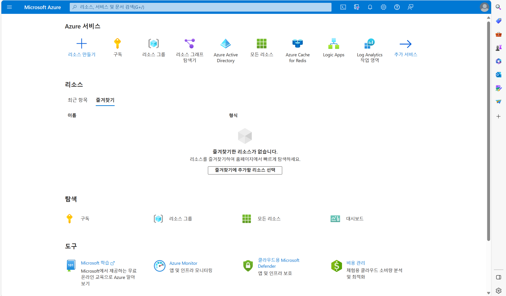

1. Azure 서비스 내 `리소스 그룹`을 선택하거나 상단 검색에서 `리소스 그룹`를 선택하고, `만들기`를 클릭합니다.

    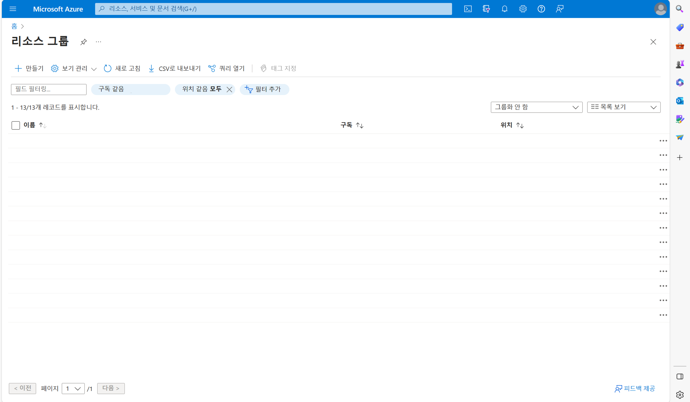

1. 현재 사용 중인 구독을 선택한 뒤, 희망하는 리소스 그룹 이름을 입력하고 [검토 + 만들기]를 클릭합니다.

    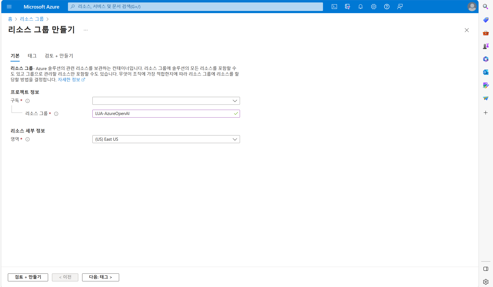

1. [Azure 포털](https://portal.azure.com/)에서 상단 검색을 통해 `[API Management 서비스]`를 선택합니다

    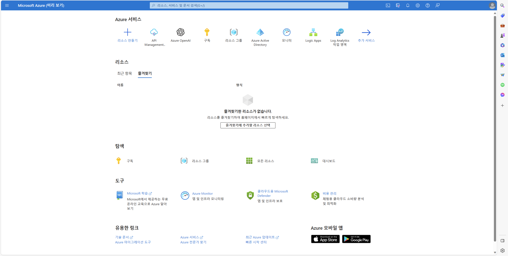

1. 상단 `만들기` 버튼을 클릭합니다.

    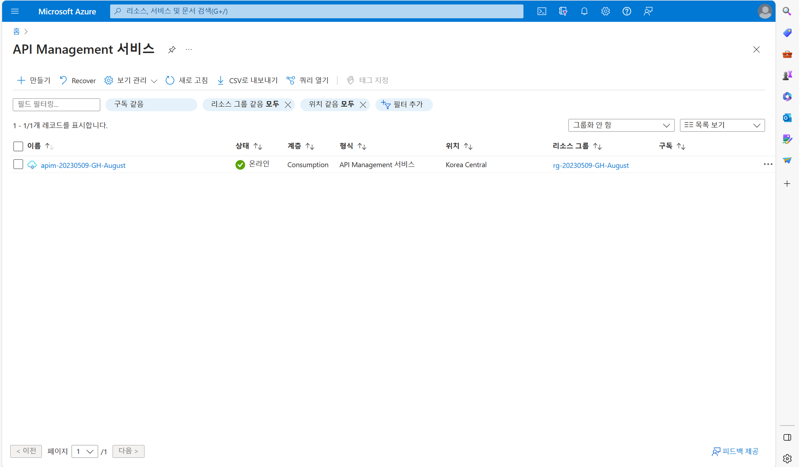

1. API Management 서비스를 만드는 데 필요한 정보를 입력한 뒤 하단의 `검토 + 만들기`를 클릭합니다.
    
    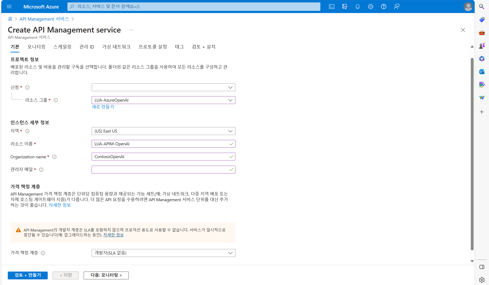

1. 신규 API Management 서비스가 만들어지면, 해당 항목으로 접속합니다.

    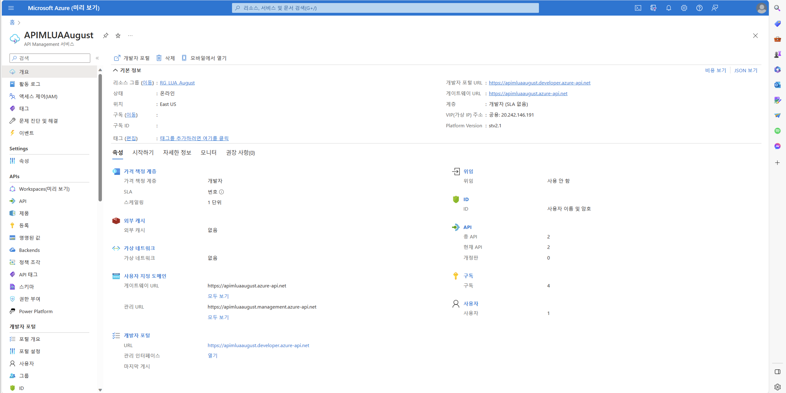

## OpenAI API를 HTTP API로 만들기

1. 좌측 메뉴 `APIs` 내 `API`를 선택하고, `Add API` 아이콘을 클릭한 뒤 `HTTP`를 선택합니다.

    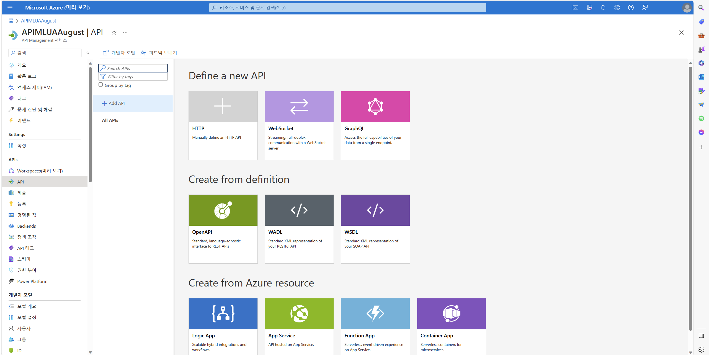

1. HTTP API를 생성하기 위해 다음과 같이 정보를 입력합니다.
    - Display name : `TESTAPI`
    - Name : `testapi`
    - Web service URL : `https://api.openai.com/v1`
    - API URL suffix : `openaiapi`

    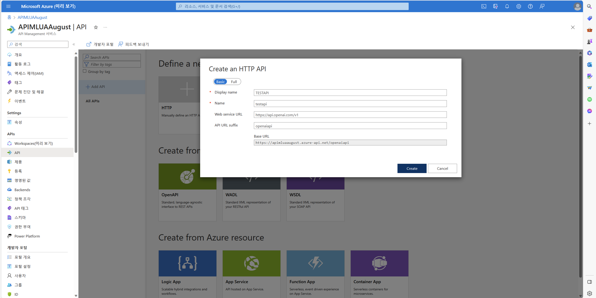

1. 전 단계에서 생성한 API를 선택하고 `Add operation`을 선택합니다.

    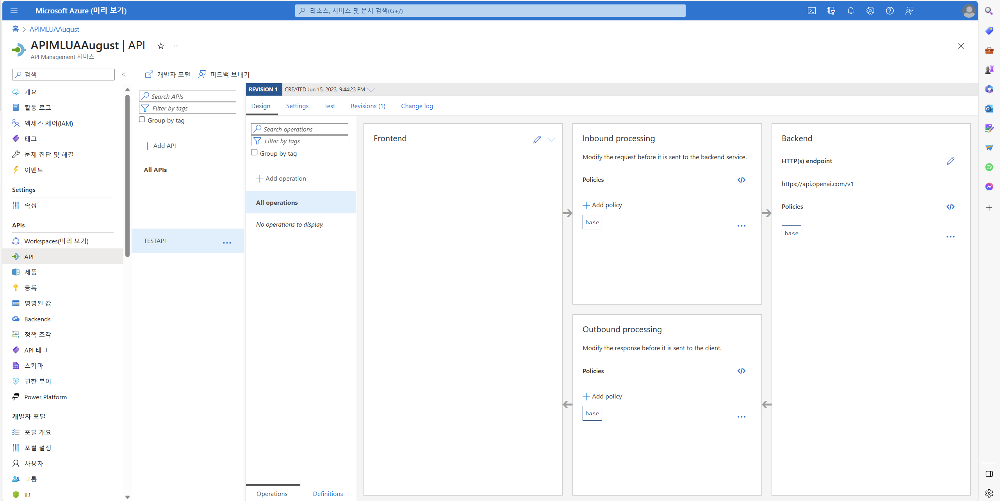

1. Frontend에 다음과 같이 정보를 입력합니다.
    - Display name : `createimage`
    - Name : `createimage`
    - URL : [POST] `/images/generations`

    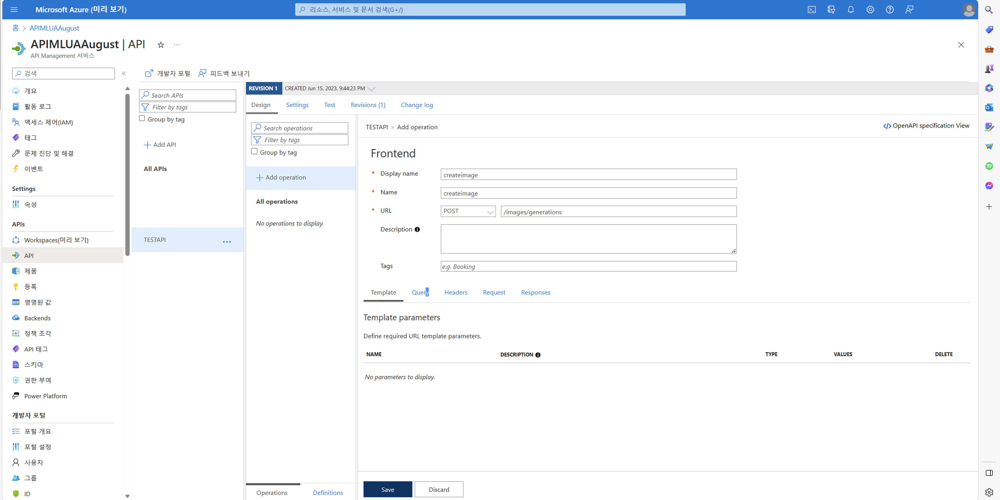


1. [Request] 탭을 선택하고 Representations 항목에 다음과 같이 정보를 입력합니다. SAMPLE 정보는 OpenAI API 레퍼런스([platform.openai.com/docs/api-reference/images](https://platform.openai.com/docs/api-reference/images/) 를 참조합니다.
    - CONTENT TYPE : `application/json`
    - SAMPLE :
    ``` 
      {
         "prompt": "A cute baby sea otter",
         "n": 1,
         "size": "512x512"
      }
    ```

    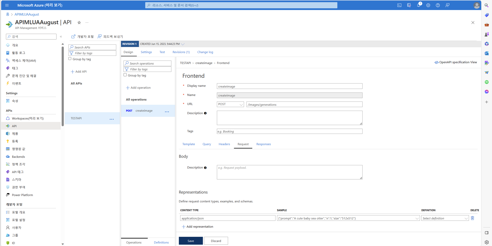

1. 전 단계에서 `DEFINITION` 드롭다운에서 `New Definition`을 선택하고 다음과 같이 정보를 입력 후 `Create definition`을 선택합니다.
    - Definition name : `ImageRequest`
    - Sample(JSON) :
    ``` 
      {
         "prompt": "A cute baby sea otter",
         "n": 1,
         "size": "512x512"
      }
    ```

    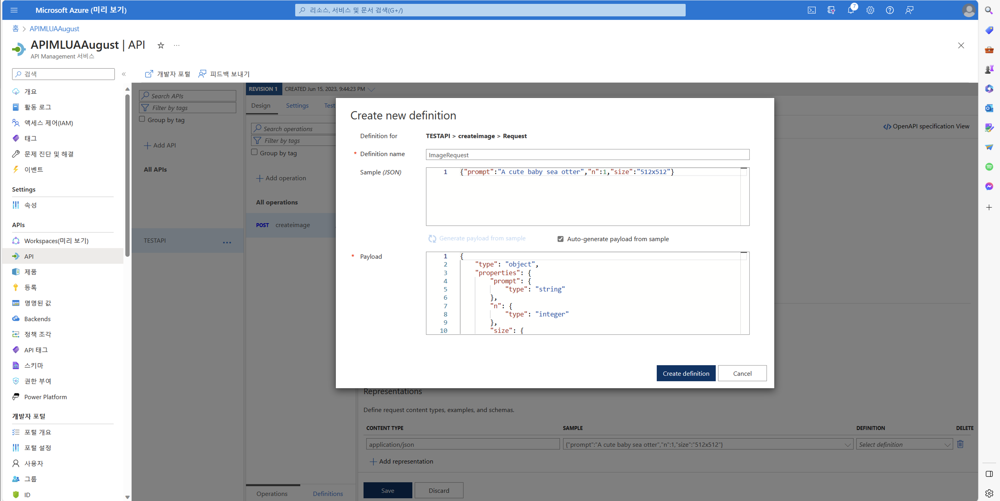

1. 전 단계에서 생성한 `ImageRequest`를 `DEFINITION`에서 선택합니다.

    

1. [Responses] 탭을 선택하고 Responses 항목 내 `Add response`를 선택합니다.

    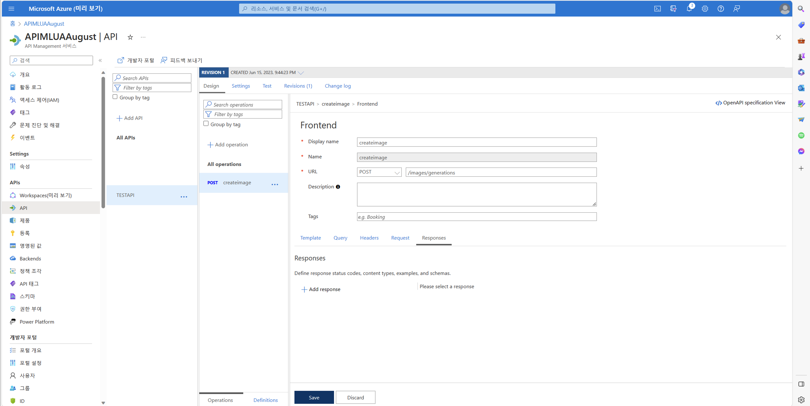

1. 드롭다운에서 `200 OK`를 클릭하고, `Add representation`을 선택합니다.

    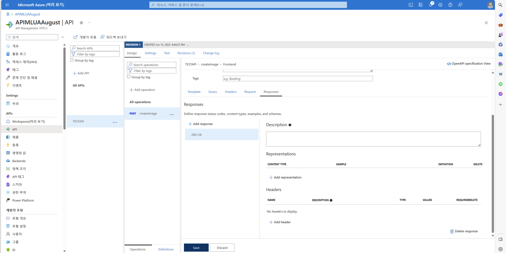

1. 전 단계에서 생성한 `200 OK`가 선택된 상태에서 Representations 항목에 다음과 같이 정보를 입력합니다.

    - CONTENT TYPE : application/json
    - SAMPLE :
    ``` 
      {
      "created": 1589478378,
      "data": [
        {
          "url": "https://..."
        },
        {
          "url": "https://..."
        }
      ]
      }
    ```
    - Definition : (선택하지 않음)

    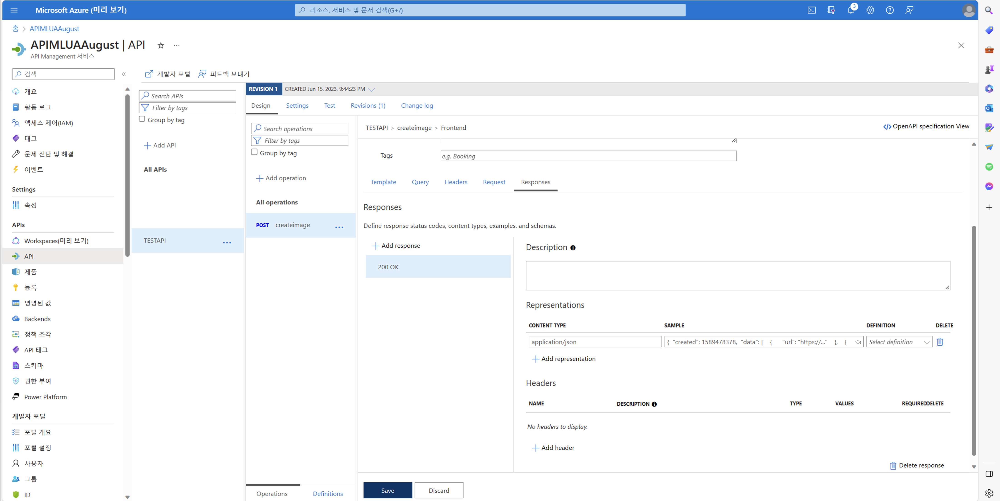

1. 전 단계에서 생성한 Operation이 선택되어 있는지 확인 후, Inbound processing 내 Policies 옆 </> 아이콘을 선택합니다.

    

1. Line 16에 다음을 추가합니다. 
    코드 중 [OpenAI API Key Here] 부분에는 [OpenAI API 관리 사이트](https://platform.openai.com/account/api-keys) 에서 생성한 API 키를 대괄호 없이 입력합니다.
    ``` 
        <set-header name="Authorization" exists-action="override">
            <value>Bearer [OpenAI API Key Here]</value>
        </set-header>
    ``` 

    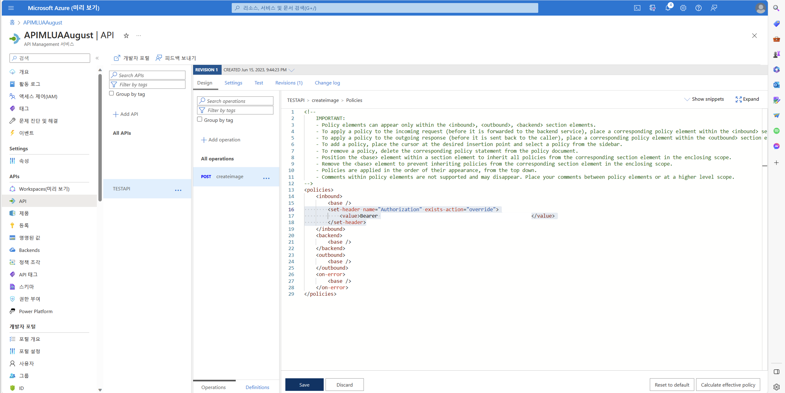

1. [Settings] 탭을 선택하고, Subscription 내 `Subscription required` 체크박스를 해제합니다.

    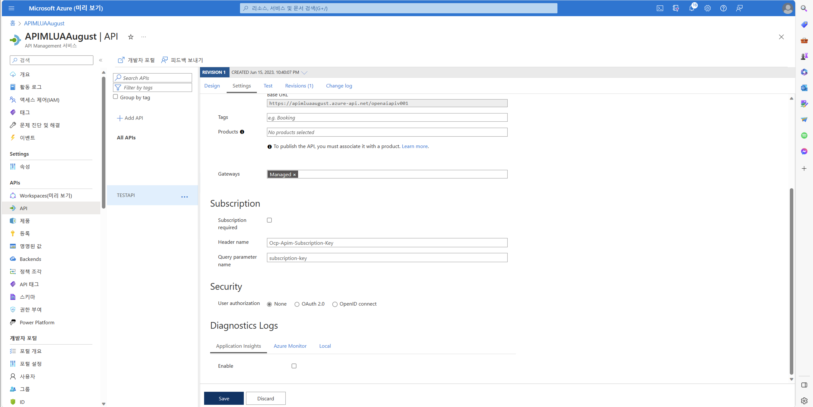

1. 좌측 메뉴 `APIs` 내 `등록`을 선택하고, `구독 추가`를 선택합니다.

    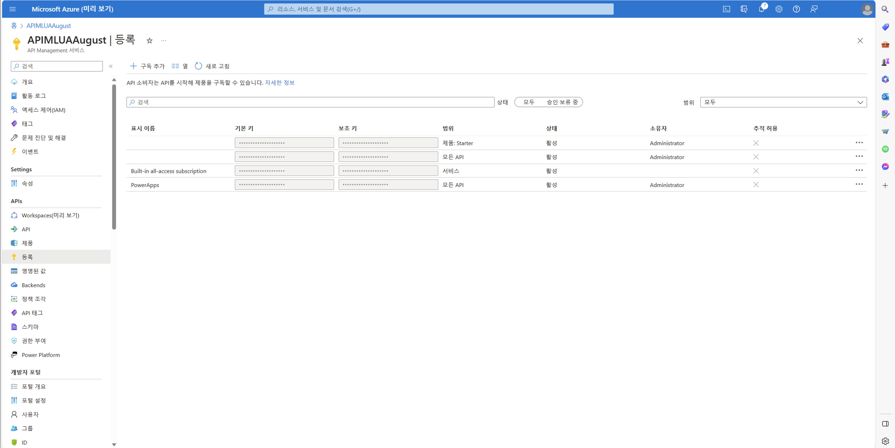

1. 새 구독에서 희망 이름과 표시 이름을 설정하고 하단의 `만들기`를 선택합니다. 새로 생성한 구독의 기본 키를 보관합니다.

    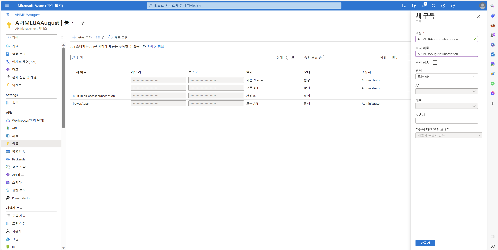

1. `Test` 탭을 선택하고, Request body에 아래의 정보를 입력 후 `Send` 버튼을 선택합니다.
    ``` 
    {
      "prompt": "A cute baby sea otter",
      "n": 1,
      "size": "512x512"
    }
   
    ``` 

    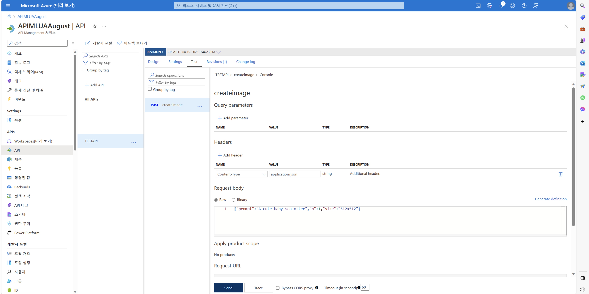

1. HTTP/1.1 200 OK 메시지가 나타나는지 확인합니다.

    

1. 좌측 메뉴 `APIs` 내 `Power Platform`을 선택하고, `커넥터 만들기`를 선택합니다.

    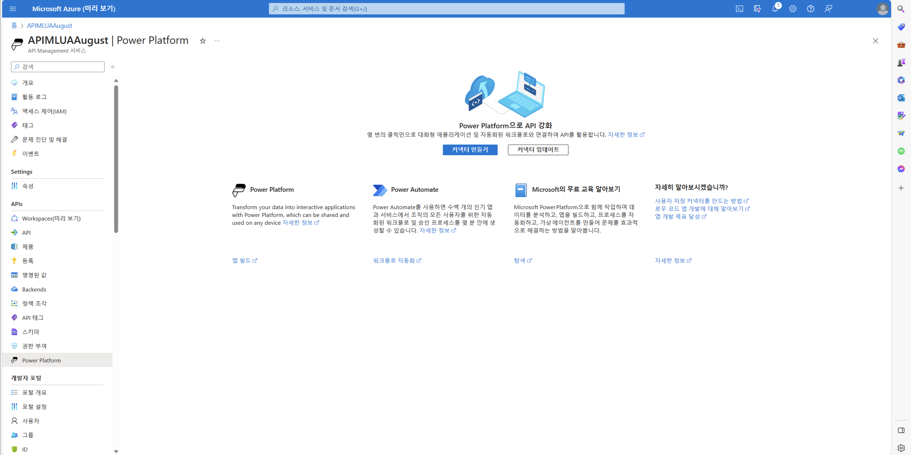

1. 전 단계에서 생성한 API를 선택하고 하단의 `만들기`를 선택합니다.

    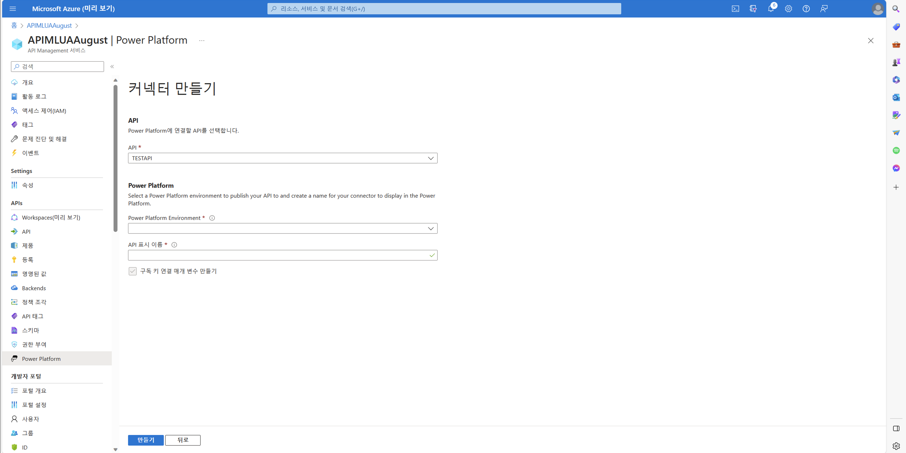

## Azure API Management 서비스로 Power Apps 이미지 생성 애플리케이션 만들기

1. [Power Apps](https://powerapps.microsoft.com/ko-kr/)에 접속하여 로그인합니다.

    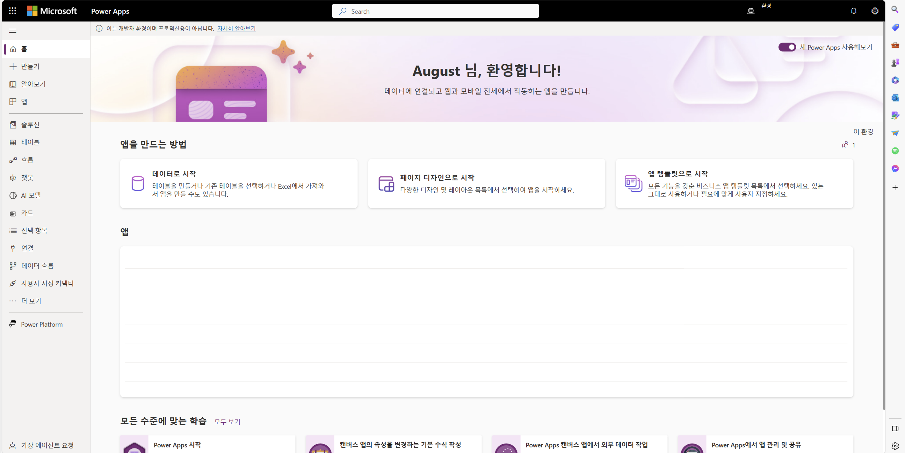

1. 좌측 메뉴에서 `사용자 지정 커넥터`를 선택한 뒤, 전 단계에서 생성한 커넥터의 오른쪽 연필 아이콘인 `편집`을 선택합니다.

    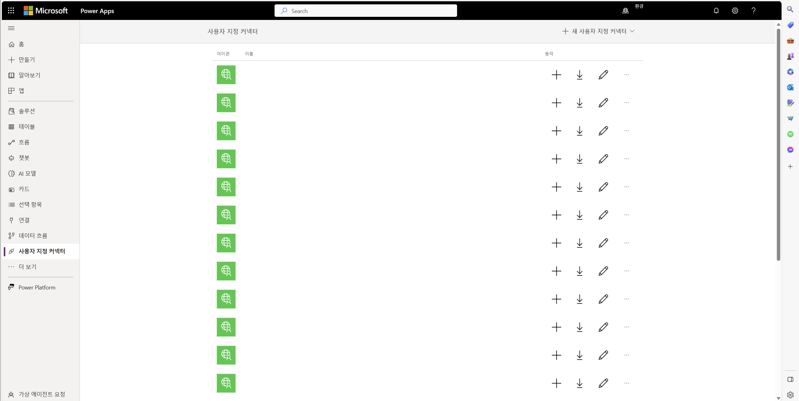

1. [3. 정의] 탭을 선택한 뒤, 응답 내 `200`을 선택합니다.

    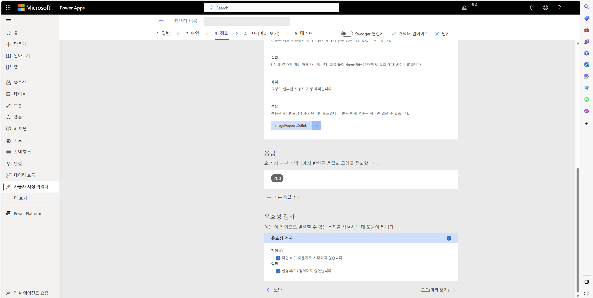

1. `샘플에서 가져오기`를 선택합니다.

    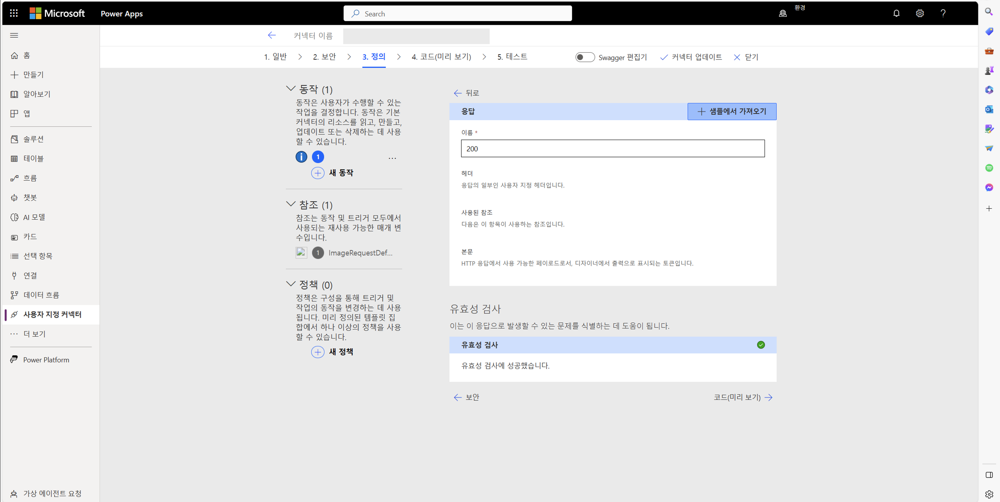

1. 본문에 아래의 정보를 입력 후 `가져오기` 버튼을 선택하고, `커넥터 업데이트`를 선택합니다. 
    ``` 
    {
      "created": 1589478378,
      "data": [
        {
          "url": "https://..."
        },
        {
          "url": "https://..."
        }
      ]
    }

   
    ``` 

    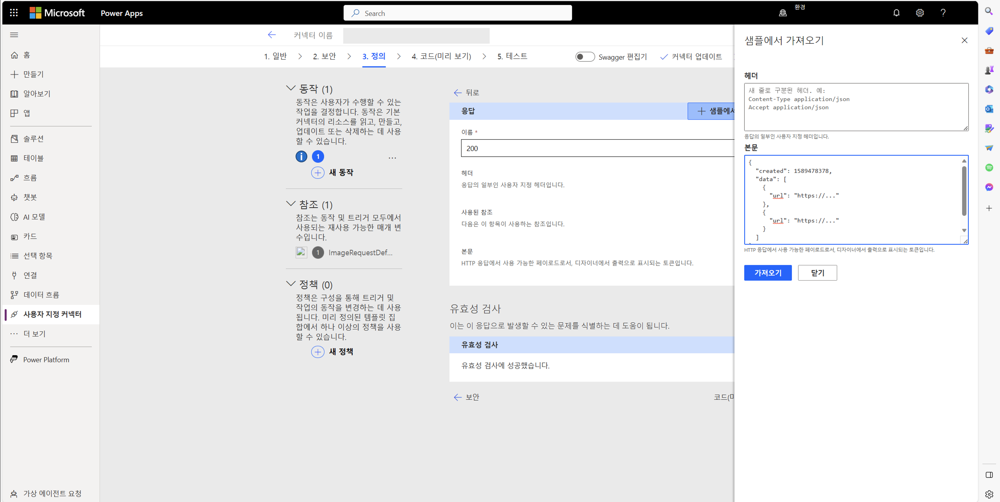

1. Power Apps 좌측 메뉴에서 `앱`을 클릭한 뒤 `새 앱`을 선택합니다. 

    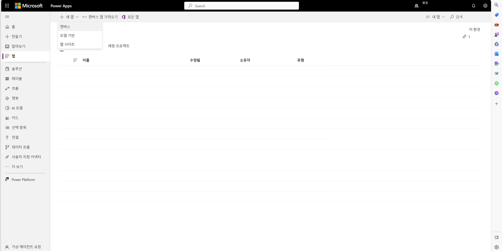

1. 앱 이름을 입력 후 `만들기`를 선택합니다.

    

1. Power Apps 앱 개발에 필요한 기본 항목을 삽입합니다.

    

1. 좌측 데이터 메뉴에서 데이터 원본을 선택합니다.

    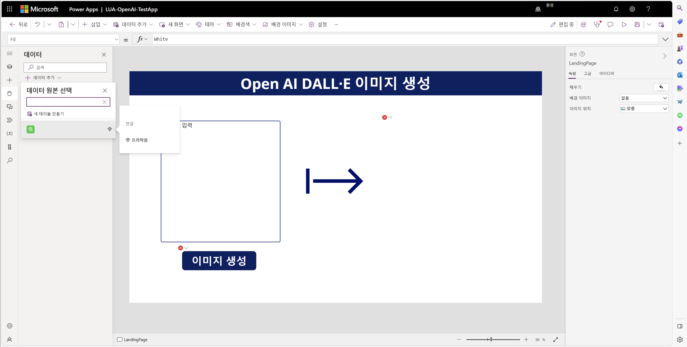

1. 사전에 저장해둔 기본 키를 `구독 키`에 입력합니다.

    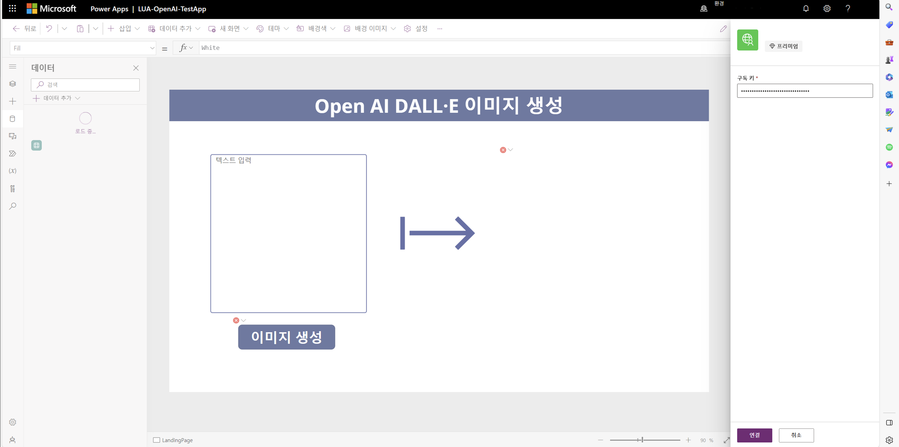

1. `이미지 생성` 버튼의 OnSelect 속성에 다음 함수를 추가합니다.
    ``` 
    	ClearCollect(_datacollection, APIName.ImageRequest({prompt: TIDALLE.Text, n:1, size:"512x512"}).data);
        Reset(TIDALLE)
    ``` 

    오른쪽 이미지의 Image 속성에 다음 함수를 추가합니다.
    ``` 
        $"{First(_datacollection).url}"
    ``` 


    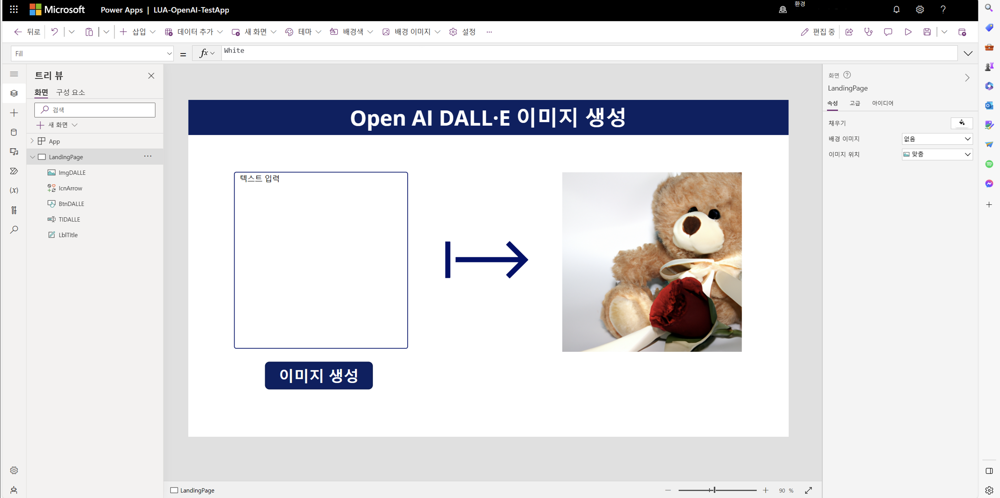

1. `이미지 생성` 버튼을 눌러 DALL·E 이미지가 Power Apps에서 정상적으로 생성되는지 확인합니다.


## Azure OpenAI API를 OpenAPI로 만들기

1. API Management 서비스 좌측 메뉴 `APIs`를 클릭한 뒤, `Add API`와 `OpenAPI`를 차례대로 선택합니다.

    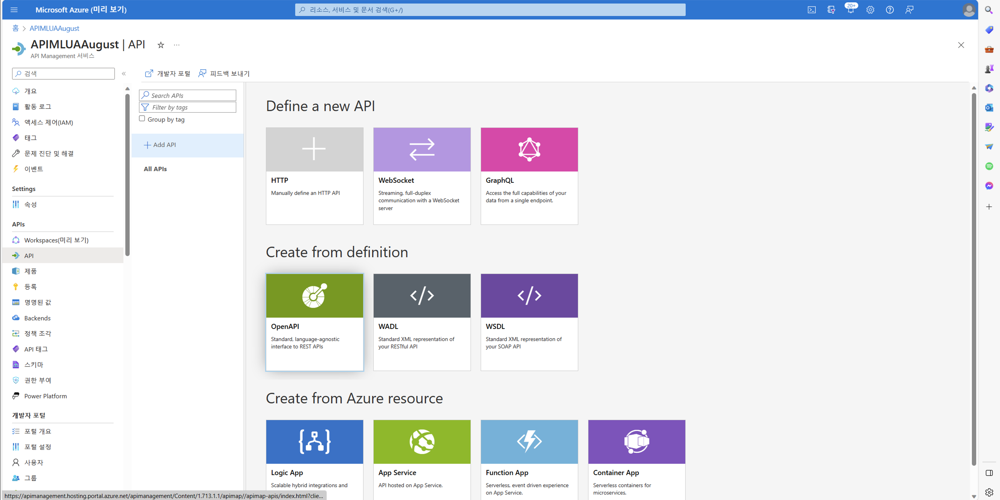

1. [JSON 파일](https://raw.githubusercontent.com/Azure/azure-rest-api-specs/main/specification/cognitiveservices/data-plane/AzureOpenAI/inference/preview/2023-03-15-preview/inference.json)에서 다운로드 받은 파일에서 Server 칸에 Azure Open AI API 엔드포인트를 입력한 뒤, [Select a file]을 선택하여 JSON 파일을 업로드 한 뒤, `Create` 버튼을 선택합니다.

    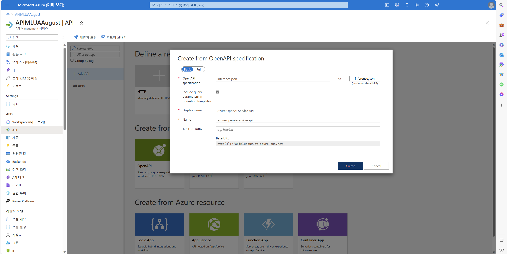
    
1. [Settings] 탭을 선택하고, Subscription 내 `Subscription required` 체크박스를 해제합니다.

    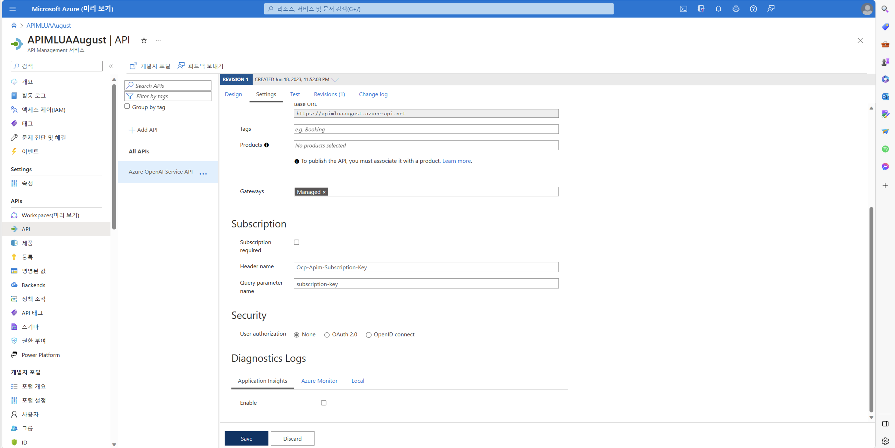

1. 좌측 메뉴 `APIs`를 클릭한 뒤, `명명된 값`과 `추가`를 차례대로 선택합니다.

    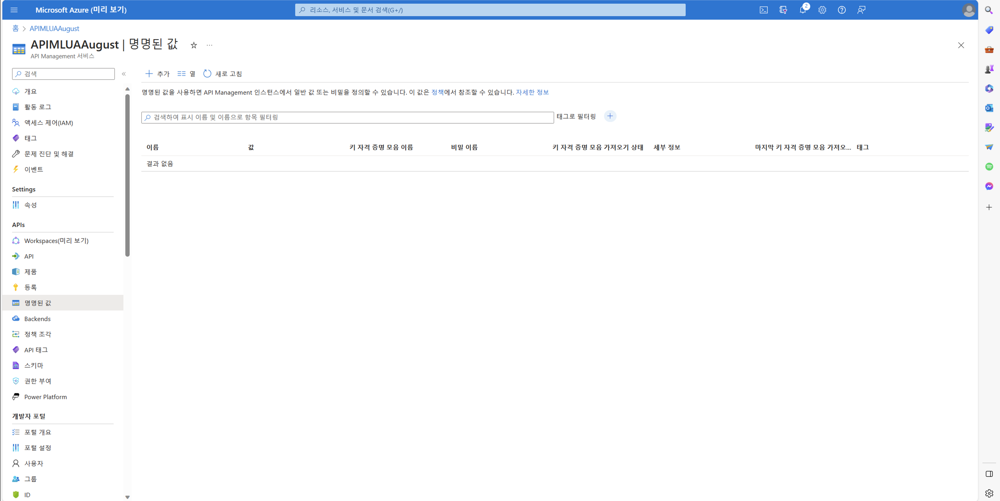

1. `명명된 값 추가` 항목에 다음과 같이 정보를 입력합니다.

    - 이름 : `AzureOpenAIKey`
    - 표시 이름 : `azure-openai-key`
    - 형식 : 비밀
    - 값 : (저장한 API키 입력)

    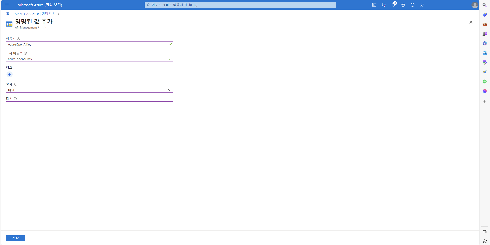

1. 좌측 메뉴 `APIs` 내 `API`를 선택하고, 전 단계에서 생성한 API와 생성된 첫 번째 operation을 선택한 뒤 Inbound processing 내 `Add policy`를 선택합니다.

    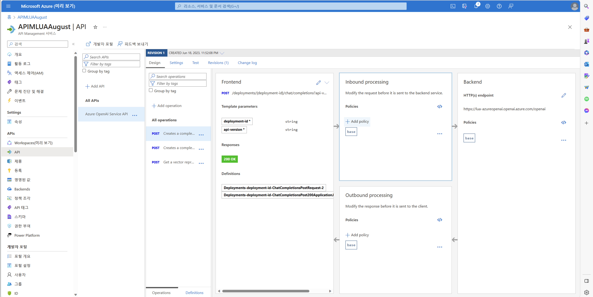

1. Add inbound policy 내 `Set headers`를 선택합니다.

    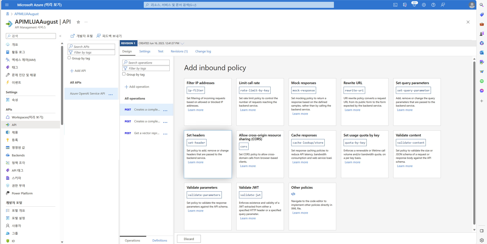

1. `Inbound processing` 항목에 다음과 같이 정보를 입력합니다.

    - NAME : `api-key`
    - VALUE : `{{azure-openai-key}}`
    - ACTION : append
    
    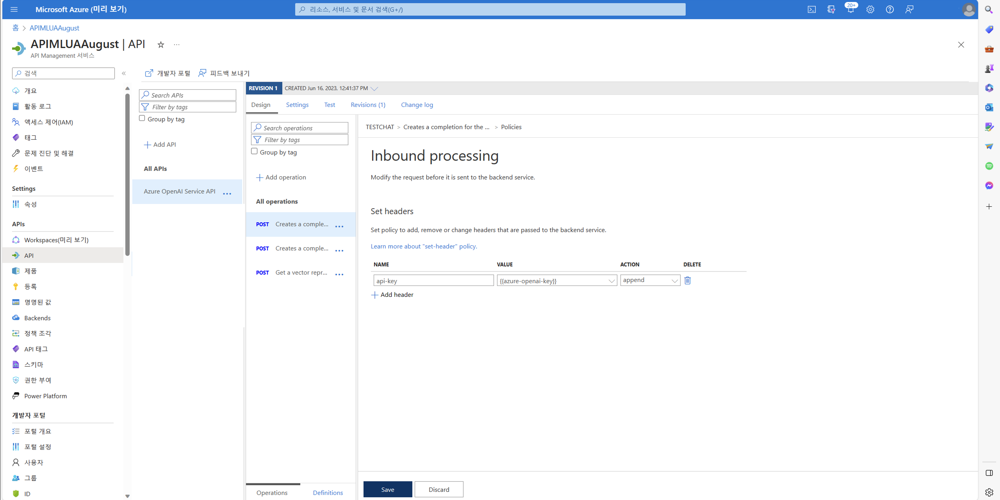

## Azure API Management 서비스로 Power Apps 텍스트 생성 애플리케이션 만들기


1. Power Apps 앱 개발에 필요한 기본 항목을 삽입합니다.

    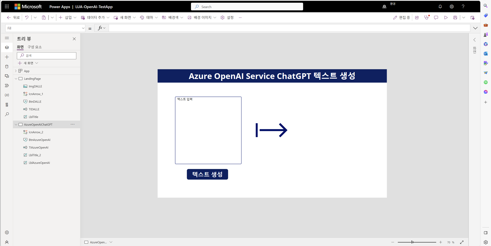


1. [텍스트 생성] 버튼의 OnSelect 속성에 다음 함수를 추가합니다.
    ``` 
    	    ClearCollect(
	        _datacollection,
	    TESTAzureOpenAIServiceAPI.ChatCompletionsCreate(
	                "GPT35TURBO",
	                "2023-03-15-preview",
	                Table({ role: "user", content: TextInput1, name: "August" }
	                )
	            )
    )
    ``` 

    오른쪽 텍스트의 Text 속성에 다음 함수를 추가합니다.
    ``` 
        First(First(_datacollection).choices).message.content
    ``` 


    

1. `텍스트 생성` 버튼을 눌러 Azure OpenAI 서비스 ChatGPT 텍스트가 Power Apps에서 정상적으로 생성되는지 확인합니다.


## AI Builder로 Power Apps 이미지 해석 애플리케이션 만들기

1. Power Apps 앱 개발에 필요한 기본 항목을 삽입합니다.

    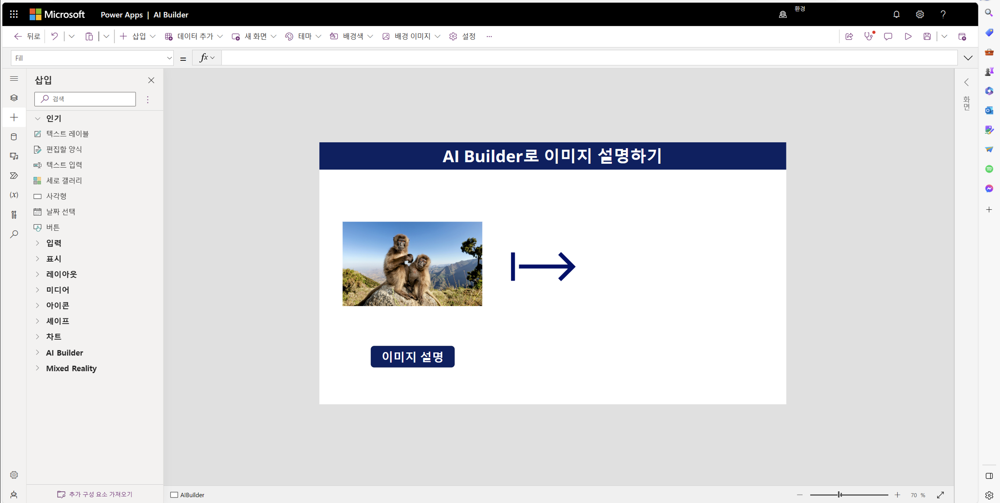


1. `이미지 설명` 버튼의 OnSelect 속성에 다음 함수를 추가합니다.
    ``` 
    	ClearCollect(_datacollection, `이미지 설명`.Predict(ImgAIBuilder))
    ``` 

    오른쪽 텍스트의 Text 속성에 다음 함수를 추가합니다.
    ``` 
        First(_datacollection).Description
    ``` 


    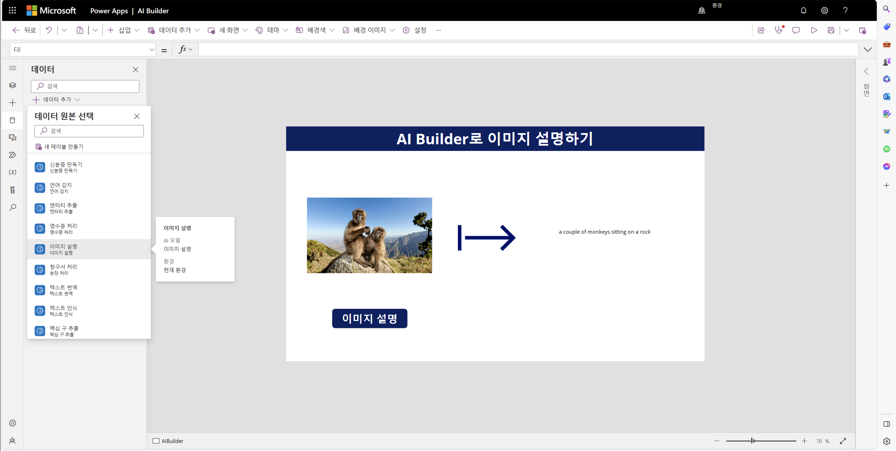

1. `이미지 설명` 버튼을 눌러 AI Builder가 Power Apps에서 정상적으로 생성되는지 확인합니다.


**긴 시간 동안 수고 많으셨습니다 🙂**
