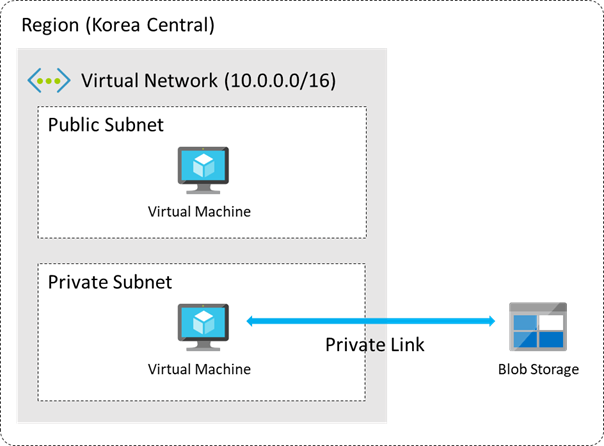

# 애져 네트워크 기본 설계

## 실습 주제

이번 실습에서는 애저의 가장 핵심 개념인 네트워크의 Virtual Network를 생성해 보겠습니다. 실제 프로덕션에서 서비스를 제공하기 위해서는 다양한 티어의 서비스들이 제공되야 합니다. 예를 들어 사용자에게 정적 컨텐트를 딜리버리해야 하는 Web 티어의 경우에는 퍼블릭 액세스가 가능해야 하고, 비지니스 로직이 있는 App 티어, 데이터베이스 티어등은 퍼블릭 액세스가 가능하지 않아야 합니다.

Virtual Network에서 이런 트래픽을 라우팅을 처리할 수 있는 방법에 대해서 알아보고 실제로 실습을 진행해 보도록 하겠습니다.

또 고객님의 VNet간 그리고 애저에서 제공되는 다양한 서비스와 고객님의 vNet간에 안전한 열결을 생성할 수 있는 Private Link 서비스에 대해서 알아보고 이 또한 직접 구성을 해보도록 하겠습니다.

### 실습 내용

- 구독 생성, Storage 어카운트 생성
- Azure Virtual Network 생성
- 서브넷 생성
- 라우팅 테이블 생성 및 연결
- Blob Storage 생성
- Service endpoint 생성

## Vitual Network 생성

Azure Virtual Network(VNet)는 Azure의 프라이빗 네트워크의 기본 구성 요소입니다. VNet을 사용하면 Azure VM(Virtual Machines)과 같은 다양한 형식의 Azure 리소스가 서로, 인터넷 및 특정 온-프레미스 네트워크와 안전하게 통신할 수 있습니다. VNet은 자체 데이터 센터에서 운영하는 기존 네트워크와 유사하지만, 확장, 가용성 및 격리와 같은 Azure 인프라 이점을 추가로 활용할 수 있습니다.

1. 애저 웹 콘솔([Home - Microsoft Azure](https://ms.portal.azure.com/#home))에 접속합니다.

1. 상단 검색 메뉴에서 virtual nerwork 를 입력해서 **Virtual Networks 화면**으로이동합니다.

1. Create 버튼을 클릭합니다.

1. 아래와 같이 구성 후,  Next : Security 버튼을 클릭합니다.

- Subscription : 생성한 구독을 선택합니다.
- Resource group : 기존의 리소스 그룹이 있는 경우 선택하고, 없을 경우 Create new를 클릭하여 **“NetworkTestResourceGroup”**를 입력합니다.
- Virtual network name : TestVNet
- Region : (Asia Pacific) Korea Central

1. 기본 설정을 그대로 두고, Next : IP addresses 버튼을 클릭합니다.

1. 기본 설정을 그대로 두고, Next : Tags 버튼을 클릭합니다.

1. 아래와 같이 구성 후, Review + create 버튼을 클릭합니다.

- Name : appID
- Value : Test

1. Review 화면이 나오면 Create 버튼을 눌러 vNet을 생성합니다.

약 1분 정도 기다리면 TestVNet이 프로비저닝 완료된 것을 확인할 수 있습니다.

1. Go to resoruce 버튼을 클릭합니다.

