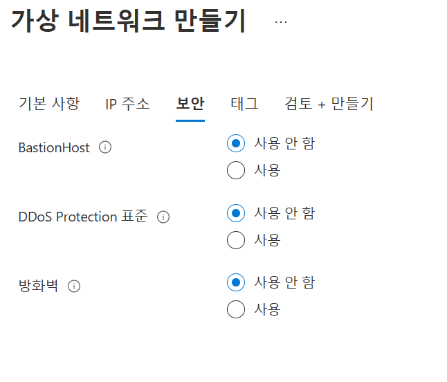
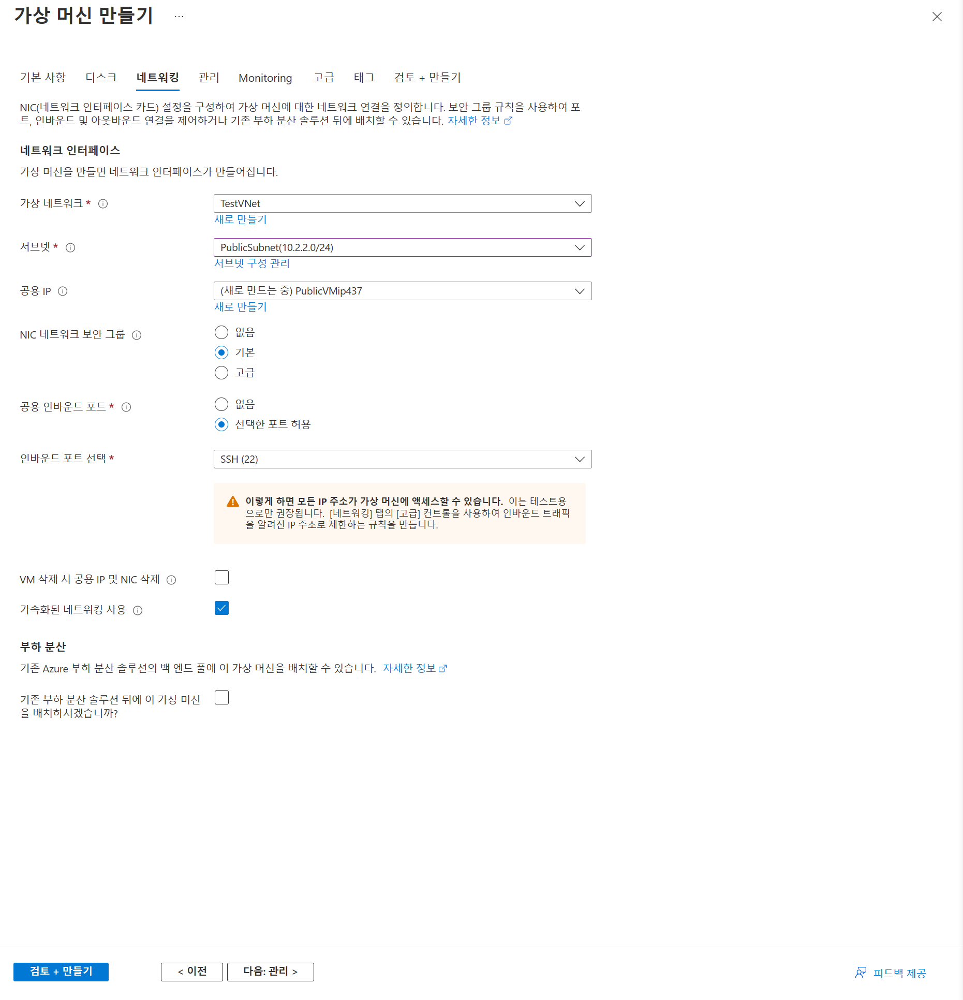
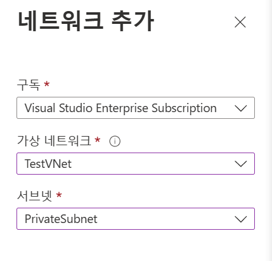

# 애저 네트워크 기본 설계

## 실습 주제


이번 실습에서는 애저의 가장 핵심 개념인 네트워크의 가상 네트워크 `VNet`를 생성해 보겠습니다. 사용자에게 정적 컨텐츠를 배포해야 하는 Web 티어의 경우에는 공개적으로 접근 가능해야 하고, 비지니스 로직이 있는 App 티어, 데이터베이스 티어등은 공개적인 접근을 막아야 합니다.

가상 네트워크에서 이런 트래픽 라우팅을 처리할 수 있는 방법에 대해서 알아보고 실제로 실습을 진행해 보도록 하겠습니다.

또 고객님의 가상 네트워크 간 그리고 애저에서 제공되는 다양한 서비스와 회사 내 가상 네트워크 간에 안전한 연결을 생성할 수 있는 프라이빗 링크 서비스에 대해서 알아보고 이 또한 직접 구성을 해보도록 하겠습니다.

### 실습 내용

- 애저 가상 네트워크 생성
- 서브넷 생성
- 가상 머신 생성
- 스토리지 생성
- 서비스 엔드포인트 생성
- 구성 테스트

## 가상 네트워크 생성


가상 네트워크는 애저에서 제공하는 프라이빗 네트워크의 기본 구성 요소입니다. 가상 네트워크를 사용하면 애저 가상 머신 (VM) 과 같은 다양한 형식의 애저 리소스가 서로, 그리고 인터넷 및 특정 온-프레미스 네트워크와 안전하게 통신할 수 있습니다. 가상 네트워크는 자체 데이터 센터에서 운영하는 기존 네트워크와 유사하지만, 확장, 가용성 및 격리와 같이 애저 클라우드 인프라에서 제공하는 이점을 추가로 활용할 수 있습니다.

1. 애저 포털([https://portal.azure.com/](https://portal.azure.com/))에 접속합니다.


2. 상단 검색 메뉴에서 가상 네트워크 를 입력해서 `가상 네트워크 화면`으로 이동합니다.


3. 만들기 버튼을 클릭합니다.

4. 아래와 같이 구성 후,  `다음: IP 주소` 버튼을 클릭합니다.


- 구독 : 생성한 구독을 선택합니다.
- 리소스 그룹 : 기존의 리소스 그룹이 있는 경우 선택하고, 없을 경우 `새로 만들기`를 클릭하여 `“NetworkTestResourceGroup”`를 입력합니다.
- 이름 : TestVNet
- 지역 : (Asia Pacific) Korea Central

5. 기본 설정을 그대로 두고, `다음: 보안` 버튼을 클릭합니다.


6. 기본 설정을 그대로 두고, `다음: 태그` 버튼을 클릭합니다.



7. 아래와 같이 구성 후, `다음: 검토 + 만들기` 버튼을 클릭합니다.


- Name : ServiceName
- Value : Test

8. Review 화면이 나오면 `만들기` 버튼을 눌러 가상 네트워크을 생성합니다.

약 1분 정도 기다리면 TestVNet이 배포 완료된 것을 확인할 수 있습니다.


9. `리소스로 이동` 버튼을 클릭합니다.

## 서브넷 생성


앞서 말씀 드린 것처럼 애저와 다른 클라우드 서비스 제공업체의 네트워크 제공 방식 중 가장 큰 차이점은 애저는 아웃바운드 트래픽 기본적으로 공개 네트워크(인터넷)에 연결 가능하다는 있다는 점입니다. 하지만 가상 머신이 인터넷과 통신하기 위해서는 위해서는 인터넷에서 들어오는 트래픽도 처리할 수 있어야 합니다. 이 때 인터넷과 통신이 가능한 서브넷을 퍼블릭 서브넷, 그렇지 않은 서브넷을 프라이빗 서브넷이라고 합니다. 사용자의 진입점이 되는 서비스들은 퍼블릭 서브넷에, 비지니스 로직을 포함하고 있는 서비스나 데이터베이스 등은 프라이빗 서브넷에 배치하는 것이 일반적인 구성입니다.

생성한 가상 네트워크 화면에서 왼쪽 서브넷 메뉴를 클릭하여 확인해 보면 아래와 같이 default 서브넷이 생성되어 있는 것을 확인할 수 있습니다. 이는 기본 서브넷으로 가상 네트워크를 생성하면 기본적으로 생성됩니다. 이제 퍼블릭 서브넷과 프라이빗 서브넷을 직접 생성해 보도록 하겠습니다.


### 프라이빗 서브넷 생성

1. 왼쪽 메뉴에서 서브넷을 선택하고 서브넷 버튼을 클릭해 줍니다. 이름은 아래와 같이 설정하고 서브넷 주소 범위는 생성한 가상 네트워크의 주소 범위 내 CIDR 범위를 지정합니다. 나머지 설정은 그대로 두고 `저장` 버튼을 클릭합니다.
- 이름 : PrivateSubnet
- 서브넷 주소 범위 : `10.2`.1.0/24


### 퍼블릭 서브넷 생성

기본적으로 가상 네트워크의 모든 리소스는 인터넷으로 아웃바운드 통신을 할 수 있습니다. 인터넷에서부터 리소스로 인바운드 연결을 위해서는 공용 IP 주소 또는 Load Balancer를 할당해야 합니다.

이를 위해 NAT 게이트웨이를 사용하도록 하겠습니다. NAT 게이트웨이는 가상 네트워크의 하나 이상의 서브넷에 대한 아웃바운드 인터넷 연결을 제공합니다. NAT 게이트웨이가 서브넷에 연결되면 NAT는 해당 서브넷에 대한 SNAT를 제공합니다. 

1. 검색창에서 NAT 게이트웨이를 입력하여 `NAT 게이트웨이` 화면으로 이동해 줍니다.


2. `만들기` 버튼을 클릭해 줍니다.


3. 아래와 같이 기본 사항을 구성해 줍니다.
- 구독 : 생성한 구독
- 리소스 그룹 : NetworkTestResourceGroup
- NAT 게이트웨이 이름 : NATGW
- 지역 : Korea Central


4. 나머지 설정은 그대로 두고 `다음: 아웃바운드 IP` 버튼을 클릭합니다.
5. 공용 IP 주소에서 `새 공용 IP 주소 만들기`를 클릭합니다. 이름을 Public-NAT-IP로 설정하고 `확인` 버튼을 클릭합니다. 아래와 같이 공용 IP 주소가 설정되면 다음:서브넷 버튼을 클릭합니다.


6. 서브넷 설정은 그대로 두고 `다음: 태그` 버튼을 클릭합니다.

7. 가상 네트워크를 설정할 때처럼 아래와 같이 태그를 설정한 뒤, `검토 + 만들기` 버튼을 클릭하여 NAT 게이트웨이를 생성해 줍니다.


- Name : ServiceName
- Value : Test

8. 이제 다시 `가상 네트워크` 화면으로 돌아갑니다. 왼쪽 서브넷 메뉴를 클릭하고 서브넷 버튼을 클릭해서 아래와 같이 구성하고 `저장` 버튼을 클릭합니다.
- 이름 : PublicSubnet
- 서브넷 주소 범위 : `10.2`.2.0/24
- NAT 게이트웨이 : NATGW


이제 퍼블릭 서브넷과 프라이빗 서브넷이 구성되었습니다. 

## 가상 머신 생성


이제 각각의 서브넷에 가상 머신을 배포해 보도록 하겠습니다.

1. 상단 검색 메뉴에서 가상 머신을 입력해서 `가상 머신 화면`으로 이동합니다.


2. `만들기` 버튼을 클릭합니다.
3. 아래와 같이 구성하고 나머지 설정은 그대로 둔 다음, `다음: 디스크` 버튼을 클릭합니다.


`프로젝트 정보`

- 구독 : 생성한 구독
- 리소스 그룹 : NotworkTestResourceGroup

`인스턴스 정보`

- 가상 머신 이름 : PrivateVM
- 지역 : (Asia Pacific) Korea Central
- 이미지 : Ubuntu Server 20.04 LTS - x64 Gen2

`관리자 계정`

- 인증 형식 : SSH 공개 키
- 사용자 이름 : azureuser (기본값)
- SSH 공개 키 원본 : 있을 경우 해당 키 선택, 없을 경우 새 키 쌍 생성
- 키 쌍 이름 : 새 키 쌍 생성의 경우, `가상머신이름_key_일자`로 자동 생성
4. 디스크 항목은 그대로 두고, `다음: 네트워킹` 버튼을 클릭합니다.
5. 아래와 같이 구성하고 나머지 설정은 그대로 둔 다음, `다음: 관리` 버튼을 클릭합니다.


`네트워크 인터페이스`

- 가상 네트워크 : TestVNet
- 서브넷 : PrivateSubnet
- 공용 IP : 없음
- 공용 인바운드 포트 : 선택한 포트 허용
- 인바운드 포트 선택 : SSH (22)

6. 관리, Monitoring, 고급 항목은 기본 설정으로 두고 `다음` 버튼을 클릭합니다.
7. 아래와 같이 Tag를 구성 후 `검토+만들기` 버튼을 클릭하여 가상 머신을 생성합니다.


- Name : ServiceName
- Value : Test

8. 리소스 배포가 완료되면 `다른 VM 만들기` 버튼을 클릭합니다.
9. 위와 동일한 방법으로 퍼블릭 서브넷에도 가상 머신을 배포해 보도록 하겠습니다.


`프로젝트 정보`

- 구독 : 생성한 구독
- 리소스 그룹 : NotworkTestResourceGroup

`인스턴스 정보`

- 가상 머신 이름 : PublicVM
- 지역 : (Asia Pacific) Korea Central
- 이미지 : Ubuntu Server 20.04 LTS - x64 Gen2

`관리자 계정`

- 인증 형식 : SSH 공개 키
- 사용자 이름 : azureuser (기본값)
- SSH 공개 키 원본 : 있을 경우 해당 키 선택, 없을 경우 새 키 쌍 생성
- 키 쌍 이름 : 새 키 쌍 생성의 경우, `가상머신이름_key_일자`로 자동 생성
10. 디스크 항목은 그대로 두고, `다음: 네트워킹` 버튼을 클릭합니다.
11. 아래와 같이 네트워킹을 구성하고, `태그`를 추가한 다음, `검토 + 만들기` 버튼을 클릭해 가상 머신을 생성합니다.



`네트워크 인터페이스`

- 가상 네트워크 : TestVNet
- 서브넷 : PublicSubnet
- 공용 IP : (새로 만드는 중)
- 공용 인바운트 포트 : 선택한 포트 허용
- 공용 인바운드 포트 : SSH (22)

이제 각각의 서브넷에 가상 머신을 배포했습니다. 퍼블릭 서브넷에 배포한 가상 머신은 SSH를 사용하여 아래와 접근 가능합니다. 프라이빗 서브넷에 배포한 가상 머신의 경우 공용 IP 주소가 할당되지 않아 SSH를 사용한 접근이 불가능합니다.

```powershell
ssh -i <private key path> azureuser@<vm-ip>
```


## 스토리지 생성


프라이빗 서브넷에 있는 가상 머신의 경우 인터넷을 통한 Blob Storage 연결이 불가능합니다. 하지만 프라이빗 서브넷에 있는 애플리케이션에서도 다른 지역에 있는 리소스나 Blob Storage에 연결해야 하는 경우가 있습니다. 이럴 때 사용할 수 있는 것이 바로 `Azure Private Link`입니다.

Azure Private Link를 사용하면 가상 네트워크의 [프라이빗 엔드포인트](https://learn.microsoft.com/ko-kr/azure/private-link/private-endpoint-overview)를 통해 Azure PaaS Services(예: Azure Storage 및 SQL Database)와 Azure 호스팅 고객 소유/파트너 서비스에 액세스할 수 있습니다.

Blob Storage를 구성하고 프라이빗 엔드포인트를 통해 액세스하도록 구성해 보겠습니다.

### 스토리지 계정 생성

1. 검색창에서 스토리지 계정을 입력하여 `스토리지 계정` 화면으로 이동해 줍니다.


2. 먼저 스토리지 계정을 생성해야 합니다. 스토리지 계정 화면에서 `만들기` 버튼을 클릭합니다.

3. 아래와 같이 구성 후 `Review` 버튼을 클릭하여 스토리지 계정을 생성해 줍니다.


`프로젝트 정보`

- 구독 : 생성한 구독
- 리소스 그룹 : NetworkTestResourceGroup

`인스턴스 정보`

- 스토리지 계정 이름 : networktestsa(임의의 숫자)
- 지역 : (Asia Pacific) Korea Central
- 성능 : `표준`: 대부분 시나리오에 권장됨(범용 v2 계정)
- 중복 : GRS(지역 중복 스토리지)

4. 배포가 완료되면 `리소스로 이동` 버튼을 클릭합니다.
5. 스토리지 계정에서 네트워킹 설정을 합니다. 생성한 서비스 엔드포인트의 오른쪽 `…` 버튼을 클릭하여 `스토리지 계정에서 가상 네트워크 구성`을 클릭합니다.


6. 스토리지 계정 목록에서 생성한 `networktestsa(임의의 숫자)` 계정을 선택합니다.
7. 왼쪽 메뉴에서 `네트워킹`을 선택한 후, `방화벽 및 가상 네트워크` 화면으로 이동합니다.
8. `공용 네트워크 액세스`에서 `선택한 가상 네트워크 및 IP 주소에서 사용`을 선택한 후, `기존 가상 네트워크 추가` 버튼을 클릭합니다.


9. 다음과 같이 설정 후 `추가` 버튼을 클릭합니다.


10. 테스트를 위해 방화벽 항목에서 `“클라이언트 IP 주소 추가” 체크박스를 체크`한 후 `저장` 버튼을 클릭합니다.

### 컨테이너 생성

1. 생성된 스토리지 계정 화면에서 왼쪽 `컨테이너` 메뉴를 클릭합니다.
2. `컨테이너` 버튼을 클릭합니다.


3. 컨테이너를 아래와 같이 구성하고 `만들기` 버튼을 클릭합니다.


- 이름 : test-container
- 공용 액세스 수준 : 컨테이너(컨테이너와 Blob에 대한 익명 읽기 액세스)

4. 컨테이너가 정상적으로 생성되고 나면 리스트에서 생성한 컨테이너를 확인할 수 있습니다.


### 리소스 업로드

1. `test-container`를 클릭합니다.
2. `업로드` 버튼을 클릭하여 `임의의 파일`을 하나 선택 후, `업로드` 버튼을 클릭합니다.
3. 업로드가 완료되면, 리스트에서 업로드한 파일을 선택하여 `URL`을 복사해 줍니다.


## 서비스 엔드포인트 생성


가상 네트워크 서비스 엔드포인트는 Azure 백본 네트워크에서 최적화된 경로를 통해 Azure 서비스에 대한 안전한 직접 연결을 제공합니다. 서비스 엔드포인트를 통해 가상 네트워크의 개인 IP 주소는 가상 네트워크에 공용 IP 주소가 없어도 Azure 서비스의 엔드포인트에 연결할 수 있습니다.서비스 엔드포인트를 사용하면 이 서브넷의 서비스 트래픽에 대한 원본 IP 주소가 공용 IPv4 주소 사용에서 프라이빗 IPv4 주소 사용으로 전환됩니다.

### 서비스 엔드포인트 정책 만들기

서비스 엔드포인트 정책을 사용하면 서비스 엔드포인트를 통해 특정 Azure 리소스에 가상 네트워크 트래픽을 필터링 할 수 있습니다.

1. 검색창에서 서비스 엔드포인트 정책을 입력하여 `서비스 엔드포인트 정책` 화면으로 이동한 뒤, `만들기` 버튼을 클릭합니다.
2. 아래와 같이 구성 후, `다음: 정책 정의` 버튼을 클릭합니다.


- 구독 : 생성한 구독
- 리소스 그룹 : NetworkTestResourceGroup
- 이름 : VNetToContainer
- 위치 : Korea Central

1. `리소스 추가` 버튼을 클릭하고, 아래와 같이 구성한 뒤 `추가` 버튼을 클릭합니다.


- 서비스 : Microsoft.Storage
- 범위 : 단일 계정
- 구독 : 생성한 구독
- 리소스 그룹 : NetworkTestResourceGroup
- 리소스 : networktestsa(임의의 숫자)

1. 태그를 다음과 같이 구성한 뒤 `검토 + 만들기` 버튼을 클릭합니다.


### 서비스 엔드포인트 추가

1. `가상 네트워크` 화면으로 이동 후, 생성한 `TestVNet`을 클릭합니다.
2. 왼쪽 메뉴에서 `서비스 엔드포인트`를 클릭합니다.
3. `추가` 버튼을 클릭하고 아래와 같이 구성한 뒤 `추가` 버튼을 클릭합니다.
- 서비스 : Microsoft.Storage
- 서비스 엔드포인트 정책 : VNetToContainer
- 서브넷 : PrivateSubnet



4. 업데이트가 완료되면 아래와 같이 서비스 리스트에서 생성한 서비스 엔드포인트를 확인할 수 있습니다.


## 구성 테스트

자, 이제 테스트를 위한 구성이 완료되었습니다. 아키텍처가 정상적으로 동작하는지 구성을 테스트 해보도록 하겠습니다.먼저 아래 명령어를 사용하여 퍼블릭 서브넷에 있는 가상 머신에 접속해 보도록 하겠습니다.

1. 퍼블릭 서브넷에 있는 가상 머신을 배스천 호스트로 사용하여 프라이빗 서브넷에 있는 가상 머신에 접속할 것입니다. SSH 연결 시 SSH 프라이빗 키가 필요하기 때문에 PublicVM에 SSH 프라이빗 키를 업로드 하도록 하겠습니다.

```powershell
scp -i <private key path> <key> azureuser@<vm-ip>:/home/azureuser
```

2. 이제 PublicVM에 접속해 줍니다.

```powershell
ssh -i <private key path> azureuser@<vm-ip>
```

3. 업로드한 SSH 프라이빗 키가 /home/azureuser 경로에 있는 것을 확인 후, 아래 명령어를 통해 읽기 전용 액세스 권한을 지정합니다.

```powershell
chmod 400 <keyname>.pem
```

4. 아래의 명령을 실행하여 PrivateVM에 연결합니다.

```powershell
ssh -i <private key path> azureuser@<vm-ip>
```


먼저 `wget` 명령어를 통해 PrivateVM에서 서비스 엔드포인트를 통해 리소스를 잘 가져오는지 테스트합니다.


정상적으로 가져와지는 것을 확인할 수 있습니다. 이제 `Ctrl + D` 키를 클릭하여 PublicVM으로 빠져나와 볼게요. 동일한 리소스에 대해 요청했을 때 서비스 엔드포인트가 구성되지 않은 VM의 경우 아래와 같이 Authorized Error 가 발생하는 것을 확인할 수 있습니다.


여기까지 애저의 가상 네트워크에 퍼블릭 서브넷과 프라이빗 서브넷을 구성하고 서비스 엔드포인트를 통해 리소스를 인터넷을 거치지 않고 액세스 할 수 있는 아키텍처를 직접 구성해 보았습니다.

### 긴 시간 동안 수고 많으셨습니다 🙂