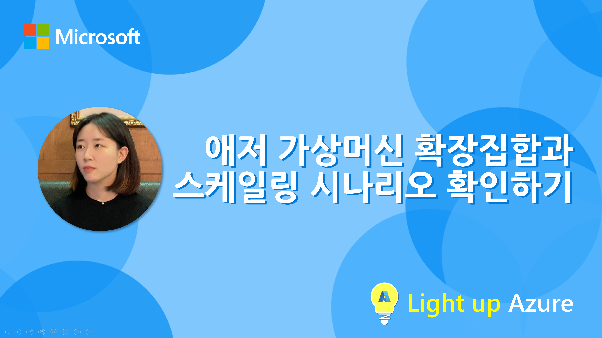
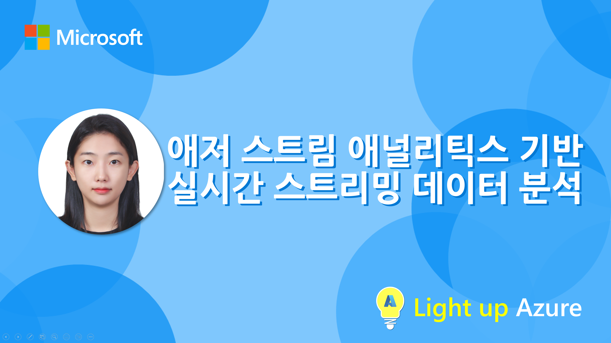

# Light up Azure &ndash; Azure Playlists Season 3

애저 플레이리스트 시리즈의 세번째 시즌, **Light up Azure**! 아래와 같은 내용으로 준비했습니다.

1. **S03E01**: 애저 네트워크 기본 설계 
   ➡️ 정보람 | 클라우드 솔루션 아키텍트 | Microsoft

    

      
    

2. **S03E02**: 애저 가상머신 확장 집합과 스케일링 시나리오 확인하기 
   ➡️ 나유강 | 클라우드 솔루션 아키텍트 | Microsoft

    

      
    

3. **S03E03**: 애저 서버리스로 서버 없이 간단한 웹 앱 만들기 
   ➡️ 어거스트 리 | 클라우드 솔루션 아키텍트 | Microsoft

    

      
    

4. **S03E04**: 애저 스트림 애널리틱스 기반 실시간 스트리밍 데이터 분석 
   ➡️ 공헤원 | 클라우드 솔루션 아키텍트 | Microsoft

    

      
    

에피소드는 계속 추가될 예정입니다. 많은 관심 부탁 드립니다!

---

## Contributing

This project welcomes contributions and suggestions.  Most contributions require you to agree to a
Contributor License Agreement (CLA) declaring that you have the right to, and actually do, grant us
the rights to use your contribution. For details, visit https://cla.opensource.microsoft.com.

When you submit a pull request, a CLA bot will automatically determine whether you need to provide
a CLA and decorate the PR appropriately (e.g., status check, comment). Simply follow the instructions
provided by the bot. You will only need to do this once across all repos using our CLA.

This project has adopted the [Microsoft Open Source Code of Conduct](https://opensource.microsoft.com/codeofconduct/).
For more information see the [Code of Conduct FAQ](https://opensource.microsoft.com/codeofconduct/faq/) or
contact [opencode@microsoft.com](mailto:opencode@microsoft.com) with any additional questions or comments.

## Trademarks

This project may contain trademarks or logos for projects, products, or services. Authorized use of Microsoft 
trademarks or logos is subject to and must follow 
[Microsoft's Trademark & Brand Guidelines](https://www.microsoft.com/en-us/legal/intellectualproperty/trademarks/usage/general).
Use of Microsoft trademarks or logos in modified versions of this project must not cause confusion or imply Microsoft sponsorship.
Any use of third-party trademarks or logos are subject to those third-party's policies.
